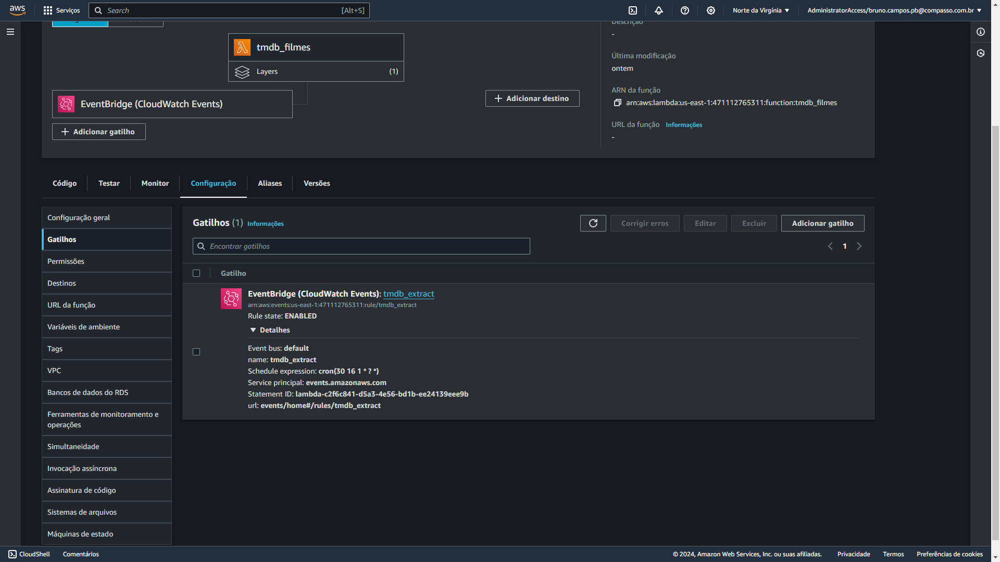
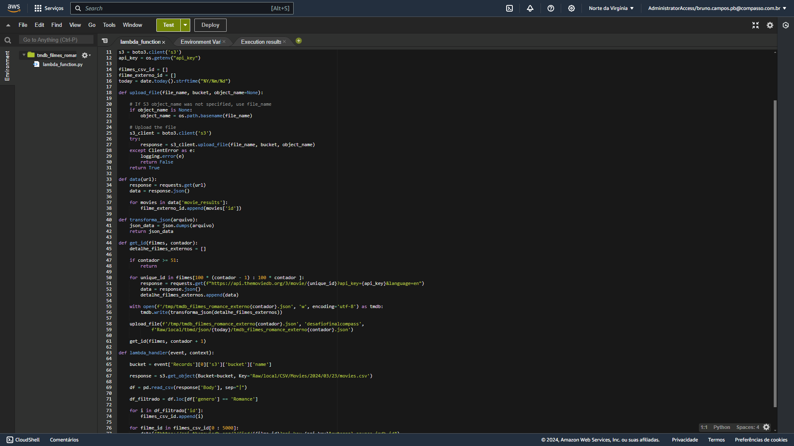
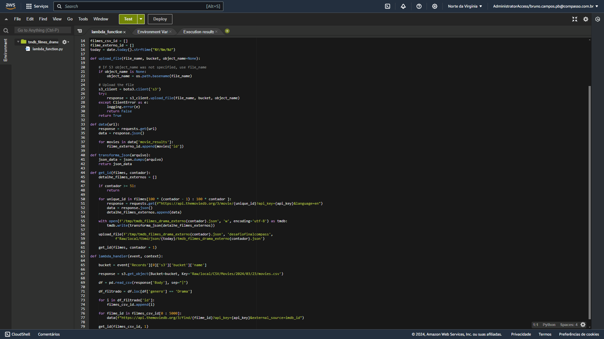
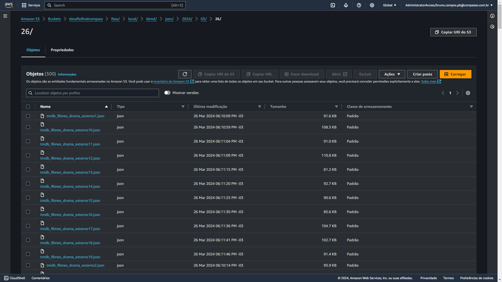

# Etapas

## Etapa 1 - Sprint 7

#### A primeira tarefa da etapa 1 foi criar um script Python que será posteriormente executado por um container Docker. O script se utiliza da biblioteca boto3 para ter acesso aos recursos da AWS, através de chaves de acesso vinculadas à conta, chaves essas utilizadas pelo método client() da biblioteca boto3

### [Script Python](./etapa-1/desafio_pt1.py)

#### Após criado o script Python, o próximo passo é construir uma imagem de Python a partir de um Dockerfile para executar o script. Em seguida será criado o container com um volume para armazenar os arquivos csv necessários

### [Dockerfile Desafio](./etapa-1/Dockerfile)

#### Ao rodar o container, os arquivos `movies.csv` e `series.csv` serão enviados ao bucket s3 e alocados nas respectivas subpastas pelo caminho informado no script Python

### Print do arquivo movies.csv no bucket s3 no caminho: desafiofinalcompass/Raw/local/CSV/Movies/2024/03/15/

### Print do arquivo series.csv no bucket s3 no caminho: desafiofinalcompass/Raw/local/CSV/Series/2024/03/15/

## Etapa 2 - Sprint 8

#### Nesta etapa do desafio final, foram criadas funções através do serviço AWS Lambda para pegar dados da API de filmes e séries TMDB e salvar esses dados no Amazon s3, utilizando a linguagem Python com bibliotecas como requests e boto3

### [Descritivo das futuras análises dos dados](./etapa-2/Descritivo.txt)

## Lambda

### [Funções Lambda criadas para o desafio](./etapa-2/funcoes_lambda.ipynb)

### **Função 1** - Filmes de romance adquiridos através da API do tmdb pelo endpoint: 'discover'

### Trigger para a **função 1** executado no primeiro dia de cada mês

### **Função 2** - Filmes de drama adquiridos através da API do tmdb pelo endpoint: 'discover'

### **Função 3** - Filmes de romance adquiridos através do ID do documento movies.csv usando a API do tmdb

### **Função 4** - Filmes de drama adquiridos através do ID do documento movies.csv usando a API do tmdb

## s3

### Arquivos em formato `json` com 100 resultados em cada, guardados no data lake s3 criado para o desafio final

