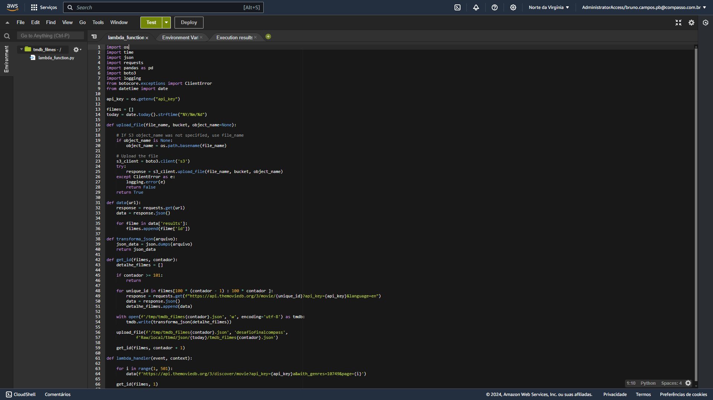
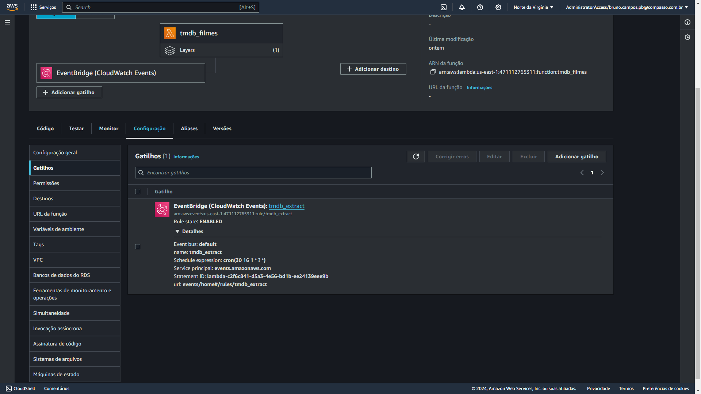
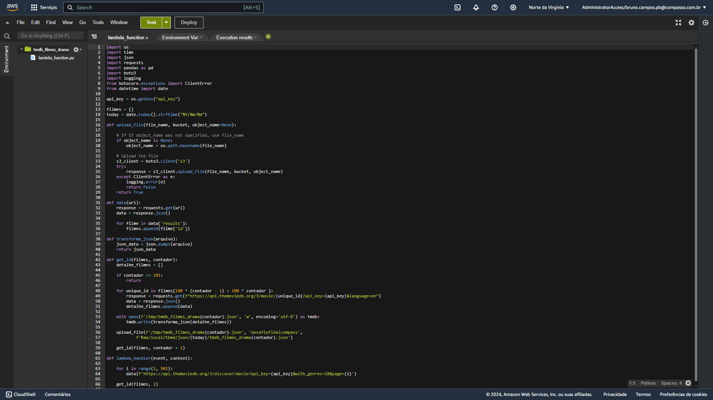
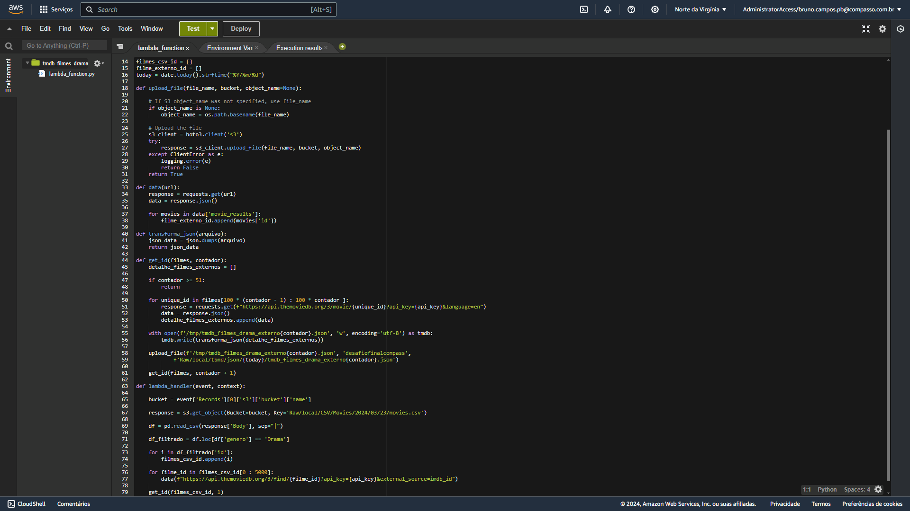
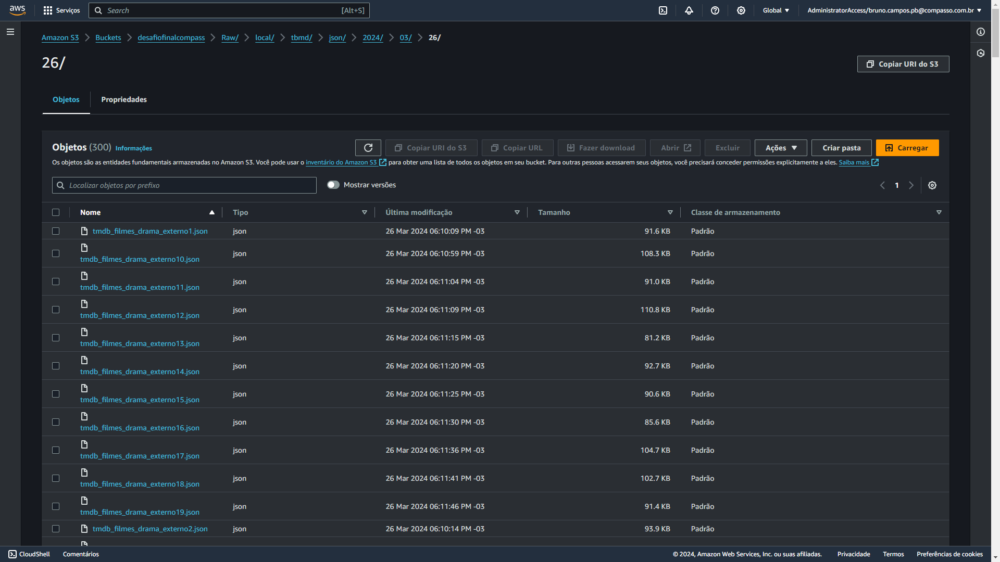

# Etapa 2 - Sprint 8

#### Nesta etapa do desafio final, foram criadas funções através do serviço AWS Lambda para pegar dados da API de filmes e séries TMDB e salvar esses dados no Amazon s3, utilizando a linguagem Python com bibliotecas como requests e boto3

### [Descritivo das futuras análises dos dados](./Descritivo.txt)

## Lambda

### [Funções Lambda criadas para o desafio](./funcoes_lambda.ipynb)

### **Função 1** - Filmes de romance adquiridos através da API do tmdb pelo endpoint: 'discover'

### Trigger para a **função 1** executado no primeiro dia de cada mês

### **Função 2** - Filmes de drama adquiridos através da API do tmdb pelo endpoint: 'discover'

### **Função 3** - Filmes de romance adquiridos através do ID do documento movies.csv usando a API do tmdb

### **Função 4** - Filmes de drama adquiridos através do ID do documento movies.csv usando a API do tmdb

## s3

### Arquivos em formato `json` com 100 resultados em cada, guardados no data lake s3 criado para o desafio final

