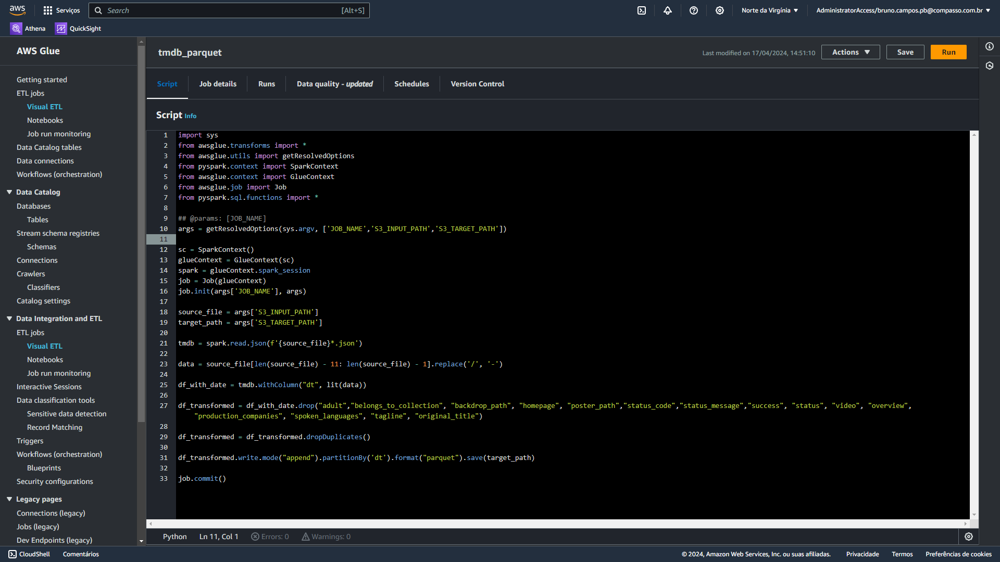
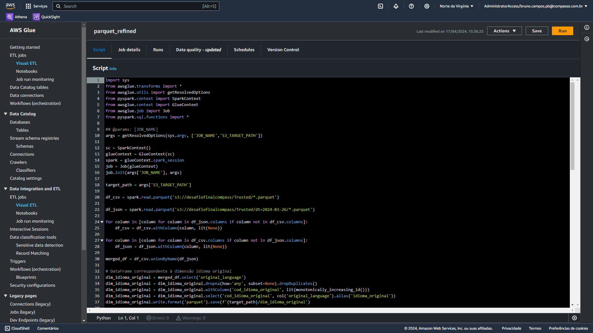
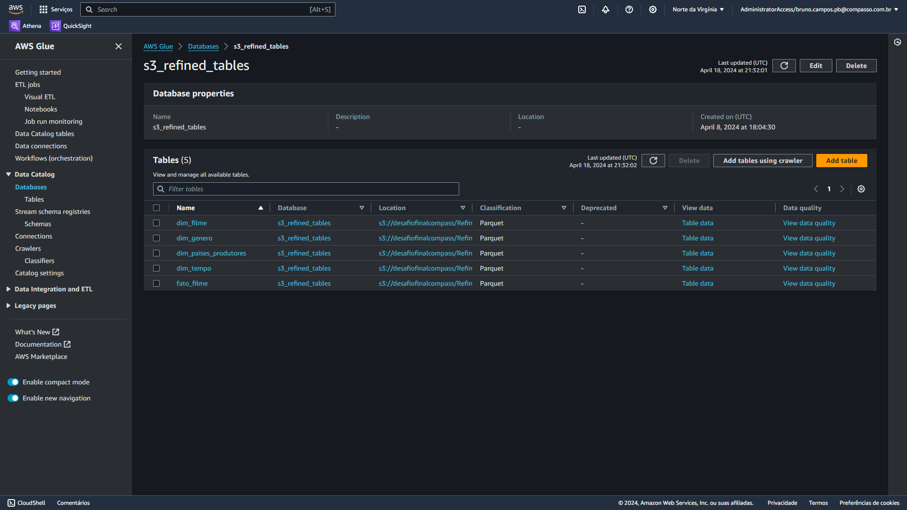

# Etapa 3 - Sprint 9

### A terceira etapa do desafio teve como objetivo pegar os dados, tanto em JSON quanto em CSV, da camada `Raw` do Data Lake s3 e realizar as modificações necessárias para que ele pudesse chegar na camada `Refined` de acordo com o modelo dimensional craido por cada um. Para isso foram necessárias `três etapas`:

## 1 - Processamento da Trusted

### Através do Apache Spark e do `AWS Glue`, criamos dois jobs, um para processar os dados em **JSON** da camada Raw e outro para processar os dados em format **CSV** na mesma camada, escrevendo os dados no formato **parquet** e enviando-os para a camada `Trusted` do Data Lake.

### [Script Spark arquivos JSON](./json_parquet.py)

### Screenshot job Spark para arquivos em JSON

## 

### [Script Spark arquivos CSV](./csv_parquet.py)

### Screenshot job Spark para arquivos em CSV

### 

## 2 - Modelagem de dados da Refined

### Essa etapa compreendeu a criação do modelo dimensional no qual os dados em parquet da camada `Trusted` seguirão. O modelo foi feito através da plataforma `draw.io` e contém todas as tabelas dimensão que serão necessárias para se ter uma melhor uma vizualização de cada filme da tabela `fato_filme` e as seus respectivos relacionamentos entre as tabelas

### [Arquivo draw io do modelo dimensional](./modelagem.drawio)

### Visualização das tabelas dimensões e da tabela fato_filme

## 3 - Processamento da Refined

### Para a última etapa utilizamos novamento o Apache Spark para criar as tabelas dimensão e a tabela fato através dos dados em parquet da camada `Trusted` e posteriormente salvar essas tabelas na camada `Refined` do Data Lake. Além da criação das tabelas, foi criado também um crawler através do serviço `AWS Glue Data Catalog` para que as tabelas na camada `Refined` fossem armazenadas em um banco de dados para posteriormente serem consultadas

### [Script Spark para criação das tabelas](./parquet_refined.py)

### Screenshot job Spark de criação das tabelas

### Screenshot do crawler utilizado para a criação das tabelas

### Screenshot das tabelas criadas pelo crawler no Glue Data Catalog

