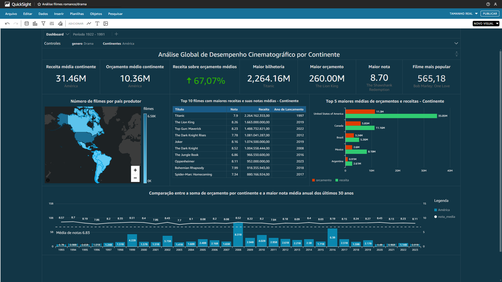

# Etapa 4 - Sprint 10

### O objetivo desta etapa final é pegar os dados que estão em um banco de dados através do `AWS Athena` e trazer as tabelas para o `QuickSight`, fazendo os relacionamentos necessários para que possamos montor o dashboard com os dados dos filmes.

### Tabelas dimensão e fato trazidas para o `QuickSight` através do `AWS Athena`

## 

### O próximo passo é, dentro da tabela fato, criar as relações entre a fato e as dimensões

### Com os dados já prontos e as relações criadas, podemos montar o dashboard usando as informações dos conjuntos de dados

### Para este dashboard, a ideia foi criar uma visão mais econômica dos filmes, utilizando informações como receita e orçamento para entender a situação de cada continente na produção de filmes, utilizando dados com o nota média e número de votos foi possível verificar se existia correlação entre, tanto orçamento quanto receita, e os filmes com as maiores notas, assim como para entender qual foi o filme com maior bilheteria e orçamento , qual o filme com a maior nota e qual o mais popular de cada continente. Além da visualização por continente, ao clicar no mapa à esquerda é possível ver os dados mensionados acima por país, caso esse possua tais informações.

### [PDF do Dashboard](./Dashboard_2024-04-23T20_26_55.pdf)

### Para o dashboard do desafio eu utilizei as informações de **países produtores** para criar uma função que me retornasse todos os continentes do mundo para que eu pudesse filtrar os dados posteriormente tanto por país quanto por continente, além de filtrar pelos gêneros `drama` e `romance` que eu escolhi trabalhar

### Função continente que separa todos os países presentes na dimensão paises produtores em seus respectivos continentes

### Visual final do dashboard mostrando o continente América

### Versão do dashboard mostrando o continente Ásia para demonstrar a mudança de valores ao alterar o campo continente e o campo gênero para romance

### Versão do dashboard mostrando o país Canada selecinado dentro do mapa, com seus respectivos valores associados a esse país

