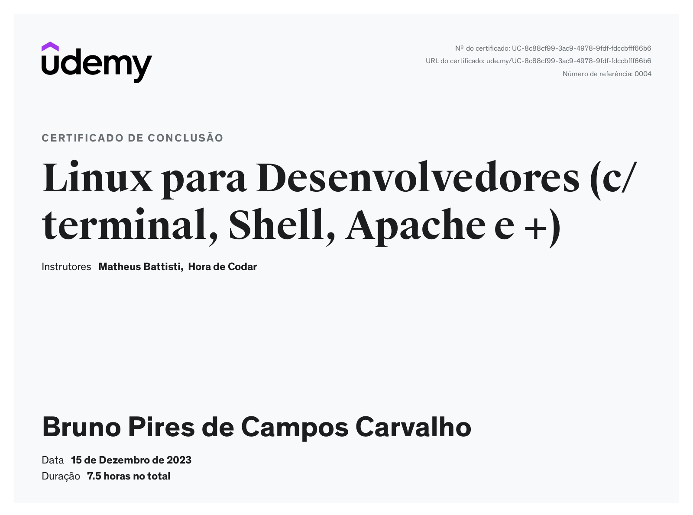
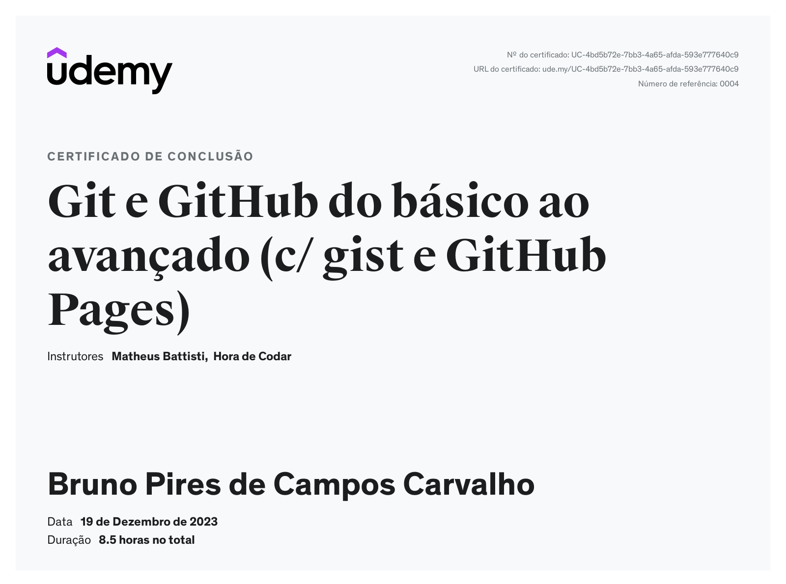

# Instruções

Neste arquivo você irá apresentar suas entregas da Sprint corrente. Observe que existem 4 diretórios no exemplo: **exercícios**, **certificados** e **evidências**.

- O diretório **exercícios** corresponde ao local onde você irá adicionar o código-fonte das atividades de codificação da Sprint, quando houver.
- O diretório **evidências** você pode utilizar para adicionar imagens demonstrando a execução/resultados de atividades, quando necessário.
- O diretório **certificados** é o local onde você irá armazenar os certificados dos cursos solicitados durante a sprint. O nome de cada certificado deve corresponder ao título do curso.

Utilize o arquivo README.md da Sprint para organizar todas as suas entregas. Faça referência aos arquivos de código-fonte. Evite colocar código diretamente no Markdown pois dificulta nossa avaliação.

# Resumo de estudo

### Linux

- A distribuição mais popular do Linux é grátis
- Utilizado na maioria dos servidores web
- Requisitos para muitas vagas
- Comunidade ativa
- Segurança, os servidores mais seguros são Linux
- Suporte nativo para muitas linguagens

---

- Comandos para navegar/alterar/deletar/criar entre arquivos
- Comandos para gerenciar pacotes dentro do Linux com update e upgrade
- Visualização de arquivos seja como um todo ou em partes
- Editores de texto inerentes ao Linux como **nano**
- Gerenciamento de permissões de acesso á arquivos e diretórios com **chmod**
- Gerenciamento báscico de redes com **ping/ipconfig**

### [anotações completas](./resumos_estudo/linux.md)

### Git

-

### [anotações completas](./resumos_estudo/git.md)

# Exercícios

1. ...
   [Resposta Ex1.](exercicios/ex1.txt)

2. ...
   [Resposta Ex2.](exercicios/ex2.txt)

# Evidências

Ao executar o código do exercício ... observei que ... conforme podemos ver na imagem a seguir:

# Certificados

- Certificado do Curso Linux para Desenvolvedores (c/ terminal, Shell, Apache e +)

  

- Certificado do Curso Linux para Desenvolvedores (c/ terminal, Shell, Apache e +)

  
