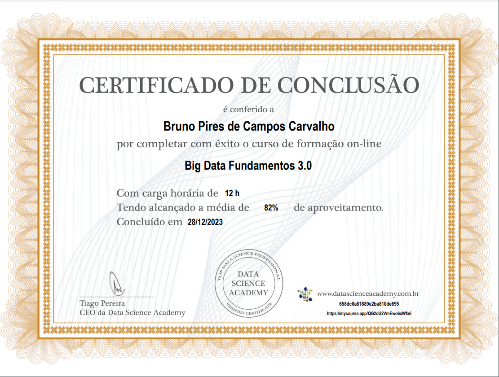
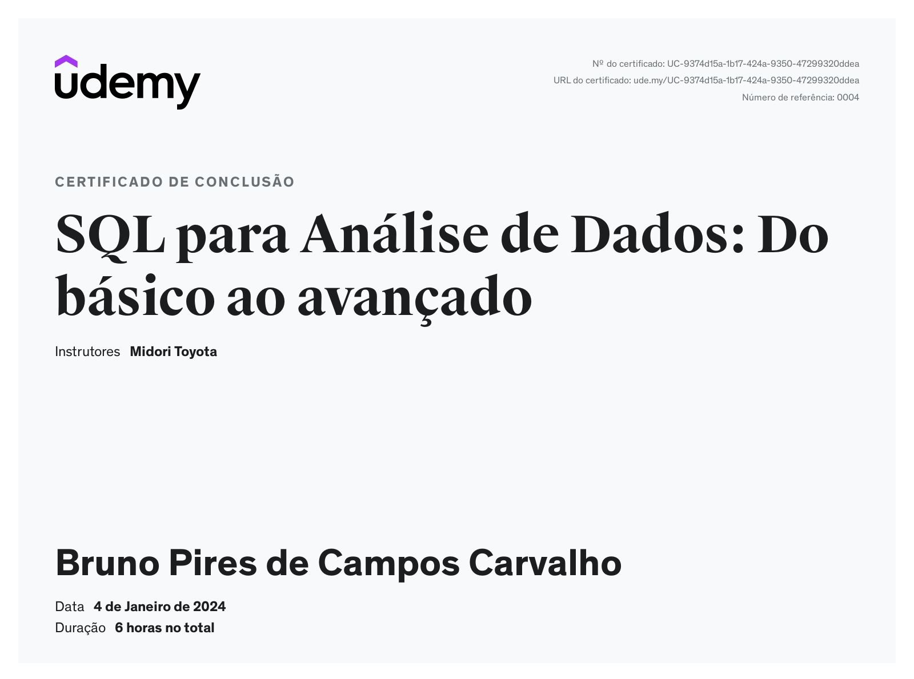

# Resumo de estudo

### **Big Data**

- Coleção de conjuntos de dados, grandes e complexos, que não podem ser processados por banco de dados ou aplicações de processamento tradicionais
- Formada por 4 V's
  - Velocidade
  - Volume
  - Variedade
  - Veracidade
- Armazenamento de dados em **Data Lakes**, **Data Warehouse**, **Data Stores**
- Processos **ETL** para Extração, Transformação e Carregamento de dados
- Processamento e Armazenamento paralelo com Apache Hadoop
- Cluster de computadores locais ou em núvem
- MLOps como conjunto de práticas para colaboração e comunicação entre Cientistas de Dados e profissionais de operações
- Definição de DataOps
- Dados como serviço (DaaS)

### [Anotações completas](./resumos_estudo/Big_Data.md)

### SQL

- Comandos básicos como SELECT, DISTINCT, WHERE, ORDER BY
- Operadores aritméticos para realizar contas e junções como + - \* / ^ %
- Operadores de comparação = = > < ≥ ≤ <>
- Operadores lógicos **AND NOT BETWEEN IN**
- Funções de agregações: **COUNT SUM MIN MAX AVG**
- **GROUP BY** para as funções de agregação
- **JOIN LEFT JOIN RIGHT JOIN INNER JOIN**
- Subqueries para usar em conjunto com **SELECT WITH**]
- Tratamento de dados com ::date ::numeric e replace
- Maninupalção de tabelas
  - criação de tabela com create table
  - criação/alteração/deleção de linhas com **insert** **into** **update** e **delete**
  - criação/alteração/deleção de colunas com **alter drop update**
- Criação de funções

### [Anotações completas](./resumos_estudo/SQL.md)

# Exercícios

1. ...
   [Resposta Ex1.](exercicios/Ex1.txt)

2. ...
   [Resposta Ex2.](exercicios/Ex2.txt)

3. ...
   [Resposta Ex3.](exercicios/Ex3.txt)

4. ...
   [Resposta Ex4.](exercicios/Ex4.txt)

5. ...
   [Resposta Ex5.](exercicios/Ex5.txt)

6. ...
   [Resposta Ex6.](exercicios/Ex6.txt)

7. ...
   [Resposta Ex7.](exercicios/Ex7.txt)

8. ...
   [Resposta Ex8.](exercicios/Ex8.txt)

9. ...
   [Resposta Ex9.](exercicios/Ex9.txt)

10. ...
    [Resposta Ex10.](exercicios/Ex10.txt)

11. ...
    [Resposta Ex11.](exercicios/Ex11.txt)

12. ...
    [Resposta Ex12.](exercicios/Ex12.txt)

13. ...
    [Resposta Ex13.](exercicios/Ex13.txt)

14. ...
    [Resposta Ex14.](exercicios/Ex14.txt)

15. ...
    [Resposta Ex15.](exercicios/Ex15.txt)
16. ...
    [Resposta Ex16.](exercicios/Ex16.txt)

# Tarefa 1

1. [Query dos 10 livros mais caros](exercicios/arquivo1.csv)

```
select l.cod, l.titulo, l.autor, a.nome, l.valor, l.editora, e.nome
from livro l left join autor a
	on l.autor = a.codautor
left join editora e
	on l.editora = e.codeditora
order by l.valor desc
limit 10
```

2. [Query das 5 editoras com maior quantidade de livros na biblioteca ](exercicios/arquivo2.csv)

```
select e.codeditora, e.nome, count(l.cod) as QuantidadeLivros
from livro l left join editora e
	on e.codeditora = l.editora
group by e.nome
order by QuantidadeLivros DESC
```

# Evidências

Ao executar o código do exercício ... observei que ... conforme podemos ver na imagem a seguir:


# Certificados

- Certificado do Curso Big Data
  

- Certificado do Curso SQL
  
