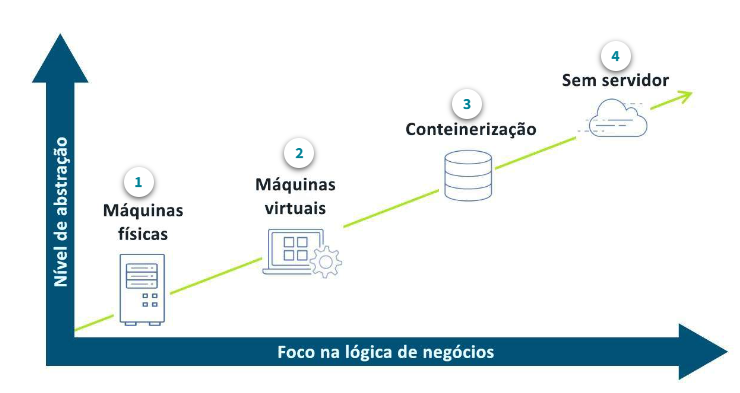
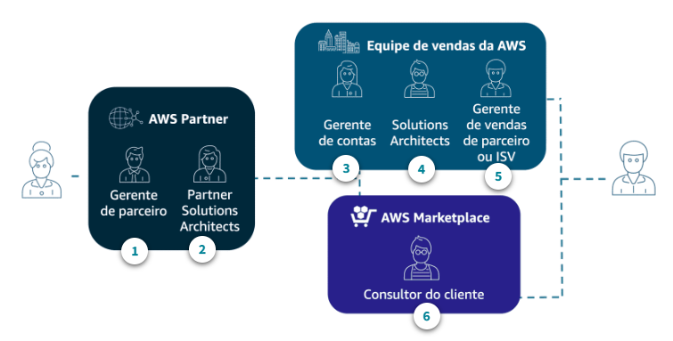

# Skill Builder

# **AWS Partner: Sales Accreditation (Business)**

### **O que é computação em nuvem?**

- Computação em nuvem é a entrega de recursos de TI `sob demanda` pela Internet com `pagamento conforme o uso`. Em vez de comprar e manter data centers e servidores físicos, você acessa os serviços de tecnologia conforme sua necessidade.

### **Padrões entre clientes da AWS**

- Em relação ao caminho para a adoção da nuvem, `cada cliente traça um roteiro diferente`. Muitos fatores internos e externos influenciam o processo de tomada de decisões e determinam onde eles começam na jornada.

### **Por que os clientes escolhem a AWS**

- A AWS oferece muitos benefícios aos clientes por meio de diversos serviços, metodologia de redução de custo e foco no crescimento e inovação do cliente.
- **Motivos para escolher AWS:**
  - `Troque os investimentos antecipados pelo modelo de consumo de pagamento conforme uso`
  - `Aumentar a velocidade e a agilidade`
  - `Simplificar a aprimorar as decisões de infraestrutura`
  - `Aumente as margens`
  - `Dimensione globalmente`
  - `Melhorar a segurança`
  - `Aumentar a inovação`
  - `Acelere o tempo de chegada ao valor comercial`

### **Infraestrutura global altamente disponível**

- As regiões AWS são compostas por várias `Zonas de Disponibilidade` para aumentar a disponibilidade, o dimensionamento e a tolerância a falhas. Aplicativos e dados são replicados em tempo real e consistentes nas diferentes zonas.
- **`Nem toda nuvem pública é igual` →** A infraestrutura global da AWS oferece verdadeira alta disponibilidade para proporcionar a `redundância e a durabilidade que os clientes exigem`. Todas as nossas Zonas de Disponibilidade são instalações fisicamente separadas
- **`A análise aprofundada é concluída considerando todos os locais em potencial` →** Normalmente, as instalações ficam a dezenas de quilômetros de distância umas das outras, o que as isola dos desastres mais comuns como enchentes, incêndios e tempestades severas
- **`Localizado na maioria das grandes cidades do mundo` →** Geralmente, esse modelo tem um custo proibitivo para um cliente estabelecer por conta própria com data centers tradicionais. Além disso, os locais de borda são usados para distribuir conteúdo aos usuários finais para reduzir a latência

A AWS oferece `mais de 200 serviços`, que variam de recursos de computação e armazenamento a Machine Learning `(ML)`, análise e serviços de Internet das Coisas `(IoT)`. A AWS continua inovando rapidamente, ampliando nossos serviços em nuvem para oferecer suporte a praticamente qualquer carga de trabalho de TI.

### **Categorias de serviço**

- Conhecer cada categoria de serviço é importante para criar soluções eficazes. As categorias de serviço mais usadas são:
- **`Computação` →** O Amazon Elastic Compute Cloud `(Amazon EC2)` oferece computação segura e dimensionável aos clientes. Os clientes podem escolher o processador, o armazenamento, a redes e o SO de acordo com as exigências da carga de trabalho. Entre os casos de uso estão aplicativos empresariais, computação de alto desempenho (HPC) e ML. Veja mais informações em
- **`Armazenamento` →** Com o armazenamento na nuvem da AWS, os clientes acessam rapidamente o objeto, o arquivo ou o armazenamento em bloco, sem o complexo planejamento de capacidade. Entre os casos de uso comum estão `data lakes, backup e restauração, arquivo e desenvolvimento de aplicativos modernos`
- **`Banco de dados` →** A AWS oferece bancos de dados com propósito específico para cargas de trabalho empresariais essenciais, que entregam aos clientes alta disponibilidade, confiabilidade e segurança. Os mecanismos de banco de dados incluem estes tipos: `relacional, chave-valor, documentos, na memória, gráficos, séries temporais e livros contábeis`
- **`Segurança` →** Com os serviços de segurança da AWS, os clientes podem `automatizar tarefas manuais como proteção de dados`, gerenciamento de identidade e acesso, proteção de rede e aplicativo, resposta a incidentes e relatórios de conformidade
- **`Gerenciamento` →** Com os serviços de gerenciamento e governança da AWS, os clientes podem provisionar e operar seus ambientes para obter agilidade de negócios e controle de governança. Os casos de uso comuns incluem gerenciamento centralizado, nuvem, gerenciamento financeiro e conformidade automatizada
- **`Redes` →** Com os serviços de redes e entrega de conteúdo da AWS, os clientes podem executar toda carga de trabalho em uma rede global, segura e confiável. Alguns casos de uso comum são: simplificar a execução de recursos, conectar infraestrutura híbrida e fornecer aplicativos mais rapidamente com redes Edge

### **O que os clientes estão criando**

- Aos poucos os clientes vão migrando os seus serviços e demandas para AWS, começando principalmente com `backups e restaurações`, avançando um pouco mais com `arquivos e conformidades`, `Data Lakes`, `aplicativos modernos` e por fim `aplicativos que são essenciais para negócio` fazendo um uso completo dos serviços oferecidos pela AWS

### **Modernização de aplicativos em geral**

- Os clientes estão passando por uma grande mudança, uma evolução da arquitetura. Eles estão mudando de um aplicativo **monolítico** para `microsserviços` menores e independentes. Os `microsserviços` são serviços mínimos de função implantados separadamente, mas que `podem interagir juntos` para alcançar um caso de uso mais amplo. Esses aplicativos se tornam mais simples de criar e manter, pois `são menores e mais gerenciáveis`.

### **Cloud Value Framework**

- O AWS Cloud Economics desenvolveu o Cloud Value Framework como uma estrutura conceitual destinada a criar um caso de negócio abrangente para a adoção da nuvem e ajuda a articular o valor da adoção da nuvem. Ele faz isso medindo e rastreando o progresso dos clientes que migraram para a AWS em relação a quatro pilares principais de valor:
  - `Economia de custo`
  - `Produtividade da equipe`
  - `Resiliência operacional`
  - `Agilidade empresarial`

### **Economia de custo**

- Conforme avançam na jornada para a nuvem, os clientes costumam pensar na redução de custos de duas maneiras:
  - Manter ou reduzir o gasto total com a AWS, independentemente do uso
  - Deixar que os custos aumentem em resposta ao aumento da demanda

### **Produtividade da equipe**

- Após a migração para a AWS, as organizações obtêm maior produtividade da equipe em muitas áreas da empresa, incluindo capacidade de gerenciamento administrativo, foco no trabalho estratégico e capacidade de se concentrar no desenvolvimento de novos recursos.

### **Resiliência operacional**

- O valor comercial que a nuvem gera na forma de resiliência inclui maior disponibilidade do sistema, latência reduzida, maior alcance de SLA e melhor segurança.

### **Agilidade empresarial**

- Agilidade refere-se à `capacidade de responder de forma rápida e eficaz a mudanças nas condições de negócios` ou eventos de negócios inovadores. Ter sucesso em um setor ou mercado digitalmente competitivo depende muito da agilidade no desenvolvimento de produtos.
- A agilidade empresarial permite mais experimentação, o que `aumenta o ritmo da inovação`. Conforme aumenta a inovação, diminui o risco de falhas de alto custo em estágios posteriores.

### Objeções à nuvem

- `custo` → Temos ferramentas e metodologias para ajudar a criar um caso de negócio e projetar a redução de custos da migração para a AWS. A mudança para a nuvem oferece benefícios adicionais que também podem ajudar a aumentar as margens ao mesmo tempo em que agrega valor comercial além de meras considerações financeiras.

- **`Segurança, conformidade e privacidade` →** Em relação à segurança dos dados, a AWS foi projetada para ser um dos ambientes de computação em nuvem mais flexíveis e seguros atualmente disponíveis. A infraestrutura central da AWS foi criada para satisfazer aos requisitos de `segurança militares`, de `bancos globais` e de outras organizações que lidam com `informações altamente protegidas`.
  - **`Criptografia` →** Os clientes da AWS podem criptografar seu conteúdo como parte de um processo de segurança padronizado para conteúdo altamente sigiloso.
- **`Déficit de habilidades` → “Nossa equipe não tem as habilidades de nuvem necessárias para dar suporte a este projeto.”**

- **`Atrelamento a fornecedor` → A liberdade de mudar para outro provedor é comumente conhecida como `reversibilidade`.**
  - A troca de custos é um compromisso entre o custo inicial e o custo futuro de transferência.
  - Do ponto de vista técnico, a AWS oferece muitos serviços baseados em `soluções de código aberto` que possibilitam não ficar “bloqueado” a uma tecnologia e que proporcionam aos clientes a melhor reversibilidade possível.
  - A nuvem AWS tem menor atrelamento porque usa o modelo de pagamento conforme o uso. `Os clientes escolhem e controlam o ritmo da migração para a nuvem`.
- **`Sustentabilidade` → “A AWS pode ajudar a melhorar o uso sustentável do nosso ambiente de TI?”**
  - A AWS oferece conhecimento e ferramentas para organizações de todos os tamanhos e de todos os setores construírem e implementarem soluções que cumpram suas metas de sustentabilidade.

### **O que é a venda conjunta?**

- A venda conjunta com a AWS é uma dinâmica de vendas em que a `AWS e AWS Partners` trabalham em conjunto em uma `oportunidade do cliente`. As equipes de vendas da AWS querem trabalhar com AWS Partners para `agilizar o tempo de entrega de valor aos clientes` por meio de soluções especializadas, conhecimento do setor e modelos flexíveis de engajamento.

### **Programas de financiamento para parceiros**

- Os programas de financiamento de AWS Partner ajudam os clientes a reduzir o custo de avaliar e migrar para a AWS. Os programas incentivam os clientes a trabalhar com AWS Partners diferenciados, pois espera-se que a participação do parceiro acelere o ritmo de adoção da AWS e minimize o risco.

# **AWS Partner: Sales Accreditation (Technical)**

## Introdução às tecnologias essenciais da AWS

### Tecnologias essenciais: Computação

- `EC2` → Parecido com uma máquina virtual, porém o usuário pode definir diversos tipos de configurações para a máquina, como `núcleos de processadores, armazenamento, memória etc`. Esse serviço pode interagir com praticamente todos os outros fornecidos pela `AWS`, assim como fazer uso `Load Balancers` e `Auto Scalling`, para gerir melhor a máquina e o tráfego que chega nela

### **Tecnologias essenciais: armazenamento**

- Serve para guardar os dados que o servidor vai utilizar, `EC2` por exemplo
- `Amazon EBS` → Serve como armazenamento para arquivos de instâncias `EC2`, podendo juntar diversos `EBS` para um instância
- `Amazon S3` → Armazenamento do objetos durável e dimensionável. Usado em `Data Lakes`, `hospedagem de aplicativos`, `backup e armazenamento`
- `Amazon S3 Glacier` → Arquivamento e backup de dados. Usado mais para dados arquivados não usados com frequência

### **Tecnologias essenciais: bancos de dados**

- `Amazon RDS` → Serviço de banco de dados com capacidade econômica e redimensionável que suporta 6 engines populares de banco de dados relacionais como: `MySQL`, `PostgresSQL`, `MariaDB` etc
- Comparado com rodar o banco de dados na própria máquina `EC2`, o `RDS` tem vantagens como:
  - Fácil de configurar, gerenciar e manter
  - Reduz o trabalho pesado genérico
  - Alta disponibilidade com o clique de um botão
  - Backup/recuperação automática
  - Aumento ou redução vertical da escala com base no padrão

### **Tecnologias essenciais: redes**

- `Amazon VPC` → Permite criar uma rede virtual na nuvem
  - Camadas de redes para recursos da AWS
- `Amazon Route 53` → Direcione usuários finais para aplicativos da internet, funcionando com um `servidor DNS`
- Dentro da rede virtual, podemos criar `sub-redes públicas e privadas` protegendo a rede e sub-rede através grupos de segurança

### **Tecnologias essenciais: segurança**

- A segurança na nuvem é a principal prioridade da `AWS`
- É semelhante à segurança nos data centers locais, sem a manutenção de instalação e hardware
- Pode ser facilmente automatizado
- Existem diversos serviços de segurança, identidade e conformidade oferecidos pela `AWS`
- O cliente trabalha em conjunto com a `AWS` para trazer melhor segurança para seu negócio. Enquanto a Amazon cuida da `segurança da nuvem e dos seus serviços`, o cliente é responsável pela segurança na nuvem
- O cliente trabalha em conjunto com a `AWS` para trazer melhor segurança para seu negócio. Enquanto a Amazon cuida da `segurança DA nuvem e dos seus serviços`, o cliente é responsável pela `segurança NA nuvem`

A `AWS Command Line Interface` (AWS CLI) fornece um conjunto de utilitários que podem ser executados por meio de um programa de comando no Linux, Mac ou Windows. A CLI é uma ferramenta de código aberto que fornece comandos para interagir com os serviços da AWS.

## De serviços a soluções

### Abordagem dos desafios dos clientes

- Primeiro é preciso entender `quais são as dificuldades dos clientes` para saber qual o melhor tipo de solução para a situação
- Através das dificuldades o `AWS Partner` pode, através do seu conhecimento das tecnologias da `AWS`, propor a melhor rota de negócio

### **Estratégias de migração**

- Os 7 passos principais para migrar arquiteturas, de física para a nuvem, são:
  - `Re-hospedar`
  - `Redefinir plataforma`
  - `Realocar`
  - `Refatorar`
  - `Retirar`
  - `Reter`
  - `Recomprar`
- Durante o processo de migração, os servidores locais são substituídos por instâncias `EC2`, o armazenamento local por `Buckets S3`, a rede local por `VPC` etc
- Tudo isso pode ser automatizado através da ferramenta `AWS Application Migration Service`

### **Práticas recomendadas de arquitetura**

- Faça um design à prova de falhas e nada vai falhar
- Crie segurança em cada camada
- Aproveite diferentes opções de armazenamento
- Implementar elasticidade
- Pense paralelo
- O acoplamento fraco liberta você
- Não tema restrições

---

- **A AWS identificou quatro práticas recomendadas principais em otimização de custos:**
- **`Dimensionamento correto de instâncias` →** O dimensionamento correto é o processo de avaliar os recursos implantados e buscar oportunidades de redução sempre que possível
- **`Aumento da elasticidade do aplicativo` →** Um exemplo é usar o auto scaling para garantir que o número correto de instâncias esteja disponível para lidar com a carga de trabalho de um aplicativo.
- **`Escolha do modelo correto de preço` →** Um exemplo é usar instâncias reservadas para cargas de trabalho que precisam ser executadas a maior parte ou o tempo todo, como ambientes de produção.
- **`Otimização do armazenamento` →** Um exemplo é a classe de armazenamento S3 Intelligent-Tiering, projetada para otimizar os custos ao mover os dados automaticamente para a camada de armazenamento mais econômica.

## Apresentação das soluções da AWS aos clientes

### Proof of Concept (POC)

- Uma das coisas mais impactantes que podemos fazer para nossos clientes é mostrar a aplicação deles `rodando na infraestrutura da AWS`, com um pequeno exemplo prático da solução que pretendemos utilizar
- Deixa o cliente avaliar a aplicação dele rodando no seu ambiente original e na nuvem para fazer comparações

## Próximos passos

### Planejamento da migração

- Divido entre:
  - `Avaliação` → Identificar a preparação e possíveis resultados comerciais
  - `Preparação e planejamento` → Corrija furos/erros que não foram pegos na parte de avaliação
  - `Migração e modernização` → Projetar, migrar e validar cada aplicativo
- Podemos usar o `MVP` para entregar pequenas fontes de valor ao longo do processo de migração

### Data Lakes e análises

- A `AWS` fornece alguns serviços para que possamos trabalhar com um grande volume de dados `(Big Data)`, entre eles estão:
  - `Amazon EMR` → Para processamento de de Big Data com os frameworks `Apache Spark` e `Hadoop`
  - `Amazon Redshift` → Para Data Warehousing das informações
  - `Amazon QuickSight` → Para criar visualizações, painéis e dashboards
-

# **AWS Partner: Cloud Economics**

### **Aspectos econômicos na nuvem**

- Focado em `2 áreas`
  - `Business value` → Sanar as dúvidas dos clientes sobre componentes financeiros e aumentar a confiança dele para migrar para a nuvem
  - `Cloud financial management`
- No geral foca em olhar para a infraestrutura local do cliente e mensurar `o quanto poderia ser ganhado` mudando as operações para a nuvem. Ajudando o cliente a ter `confiança na sua compra`

### **Redução de custos**

- Diz respeito a `diferença de custos` entre uma estrutura tradicional de TI e a estrutura da nuvem
- Um estudo publicado em 2022 pela empresa de consultoria e pesquisa global, The Hackett Group, revelou que os clientes `reduziram o gasto total com TI` ao migrarem para a AWS.
  - O gasto total com a infraestrutura de TI como uma porcentagem da receita foi reduzido, em média, `em 20%.`
  - Os custos da infraestrutura específica dos aplicativos são reduzidos, em média, `em 20%` ao ano em uma implantação de um período de seis anos.
  - O estudo do The Hackett Group revelou que, em média, após a migração, os clientes reduziram seus gastos totais de TI como um percentual da receita `em 4%`.
- Os preços de `instâncias sob demanda` permitem que os clientes paguem pela capacidade computacional que realmente usam por hora, sem compromissos de longo prazo. É possível usar esse modelo de preços para cargas de trabalho com vários graus de disponibilidade, como um ambiente de sandbox ou de um projeto com um cronograma limitado.
- O `Savings Plans` e as `instâncias reservadas` são modelos flexíveis que oferecem preços mais baixos em comparação com os preços sob demanda, em troca de compromissos de uso específico em um período de um a três anos.
- As `Spot Instances` do Amazon EC2 oferecem capacidade computacional de reserva na nuvem AWS, com grandes descontos em comparação com as instâncias sob demanda. As Spot Instances permitem economizar `até 90%` em comparação com as instâncias sob demanda

### **Produtividade da equipe**

- No Cloud Value Framework, a produtividade da equipe se refere à eficiência adquirida com a `redução ou a eliminação das tarefas não mais necessárias com os serviços de nuvem`. Por exemplo, ao migrar para a AWS, a equipe do cliente gastará menos tempo na infraestrutura e terá `mais tempo para se concentrar em novos projetos` com impacto estratégico no negócio.
- As eficiências pós-migração capacitam os clientes a `converterem funções de operações não estratégicas em funções de arquitetura e inovação`. Essas eficiências pós-migração ajudaram os clientes no estudo para mover ou converter 17% das posições da equipe da manutenção da infraestrutura e outras funções não estratégicas para posições focalizadas no planejamento da infraestrutura, arquitetura, orquestração e inovação.

### **Resiliência operacional**

- A resiliência operacional é o benefício conquistado com a melhoria na disponibilidade e na segurança. Isso representa `mais tempo ativo`, `menos tempo de inatividade` e risco reduzido.
- Manter uma infraestrutura operacionalmente `resiliente` e `disponível` envolve vários componentes, da camada de rede, servidores e armazenamento, à camada de banco de dados.
- Para usuários da `AWS`, os participantes do estudo relataram `69% menos horas de tempo de inatividade` não planejadas por ano após a migração de aplicativos para a AWS.
- As organizações de TI com resiliência operacional dependem da integridade de quatro pilares:
  - `operações` → Erros humanos, erros de configuração, erros procedurais
  - `segurança` → Malware, ataques à rede, problemas de segurança etc
  - `software` → Exaustão de recursos, erros computacionais ou lógicos, monitoramento inadequado
  - `infraestrutura` → Falhas de hardware, desastres naturais, queda de energia

### **Agilidade empresarial**

- A agilidade empresarial significa `entregar mais`, por exemplo, `responder mais rapidamente`, fazer mais experiências e `entregar resultados no mesmo tempo ou antes`. Trata-se da habilidade de agregar mais valor aos clientes.
- Maior `velocidade na entrada no mercado`, tomada de decisão mais rápida e risco de experimentação reduzido estão colaborando com os resultados financeiros dos clientes da AWS que vão além do departamento de TI.

### **Sustentabilidade**

- Resumindo, a sustentabilidade significa `evitar o esgotamento dos recursos naturais` para manutenção do balanço ecológico.
- A AWS pode ajudar os clientes a conquistarem suas metas de sustentabilidade e a `reduzir suas pegadas de carbono` em várias áreas:
  - **Infraestrutura energeticamente eficiente da AWS**
  - **Servidores mais eficientes e maior utilização de servidores**
  - **Consumo reduzido de eletricidade e uso de energia renovável**

### **Gerenciamento financeiro na nuvem**

- **Os quatro pilares do gerenciamento financeiro na nuvem:**
  - `medição e responsabilidade` → Uma área do framework focalizada nas capacidades que permitem que as organizações estabeleçam visibilidade dos custos e responsabilidade por gastos.
  - `otimização de custos` → focaliza as capacidades que permitem que as organizações paguem somente pelos recursos de que precisam
  - `planejamento e o forecast` → O planejamento e o forecast focalizam os recursos que permitem que os clientes melhorem a previsibilidade das cargas de trabalho atuais e novas na nuvem.
  - `operações financeiras na nuvem` → Focalizam a identificação e o investimento em pessoas, processos, ferramentas e automação para oferecer suporte ao gerenciamento financeiro na nuvem

### **Avaliação do portfólio da migração**

- A MPA ajuda os clientes a `analisarem os dados sobre o inventário atual de TI on-premises` e a mapearem esses recursos para serviços da AWS para fazerem uma comparação de custos simples. Os clientes podem usar esses dados para validar seus casos de negócio e criar planos de migração.
- Também podem usar esses dados para estimar o nível de trabalho e os custos associados à migração e para calcular as taxas de execução anuais dos recursos de computação e de armazenamento na AWS. Essas informações geralmente definem o conjunto de dados completo necessário para analisar e priorizar corretamente as migrações de aplicativos.
