# Resumo de estudo

### Data Analytics Fundamentals

- `Avaliação` é um exame detalhado de algo para entender sua natureza ou determinar suas características essenciais. `Avaliação de dados` é o processo de compilar, processar e analisar dados para que você possa usá-los para tomar decisões.
- Conhecer a origem dos dados é um dos desafios da análise de dados.
- Há três classificações amplas de tipos de origem dos dados:
  - `Dados estruturados` →  são organizados e armazenados na forma de valores que são agrupados em linhas e colunas de uma tabela.
  - `Dados semiestruturados` →  muitas vezes são armazenados em conjuntos de pares de chave-valor que são agrupados em elementos em um arquivo.
  - `Dados não estruturados` → não são estruturados de forma consistente. Alguns dados podem ter uma estrutura semelhante a dados semiestruturados, mas outros podem conter apenas `metadados`.
- A coleta e o processamento de dados são combinados em um único conceito conhecido como `processamento de dados`.
- Processamento programado em **batch** → representa dados que são processados em um volume muito grande de forma programada regularmente
- Processamento quase em tempo real **(stream)** → representa dados de streaming que são processados em pequenos batches individuais
- Os dados estruturados são classificados como dados armazenados em um banco de dados ou em um sistema de gerenciamento de banco de dados (DBMS)
- Bancos de dados de processamento de transações on-line (OLTP) → organizam logicamente os dados em tabelas, com foco principal na `velocidade da entrada de dados`.
- Bancos de dados de processamento analítico on-line (OLAP) → organizam logicamente os dados em tabelas, com foco principal na `velocidade da recuperação de dados por meio de consultas`.
- A integridade dos dados tem a ver com garantir que seus dados sejam confiáveis. Eles têm integridade? Toda a cadeia de dados estava segura e sem comprometimento?
- `Esquema de dados` → é o conjunto de metadados usado pelo banco de dados para organizar objetos de dados e impor restrições de integridade.
- Os `relatórios analíticos` são apresentados em vários formatos e tamanhos diferentes. A origem dos dados raramente afeta os relatórios resultantes. Os relatórios são organizados para atender às necessidades dos consumidores dos relatórios.

### 

# Evidências

## Lab 1 - S3

### Arquivos do S3

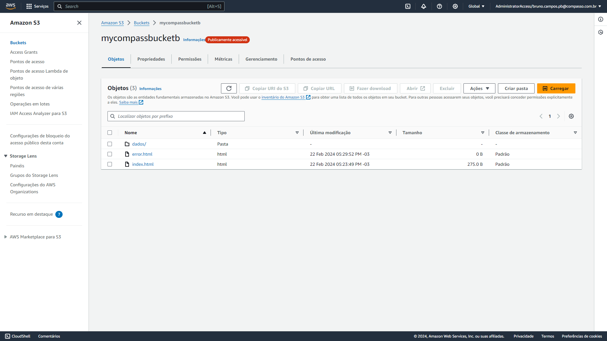

### Site estático

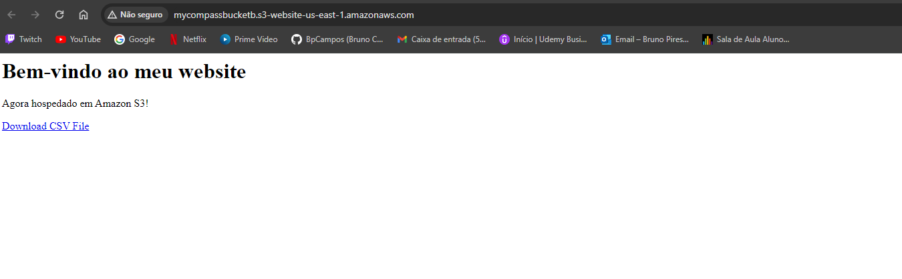

## Lab 2 - Athena

### Print da tela do Athena

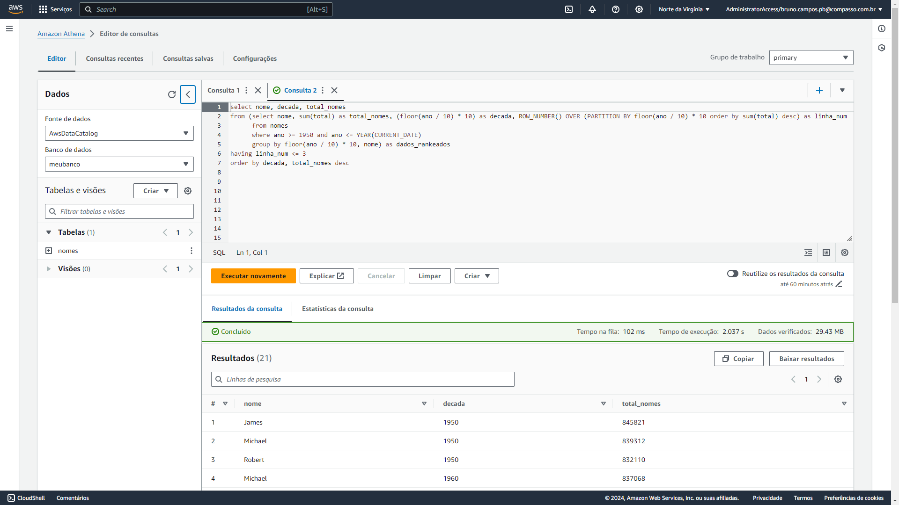

### Query Athena

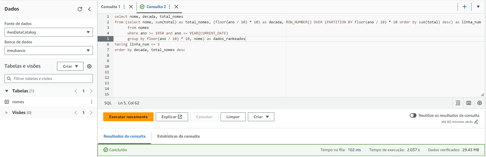

### Resultado query

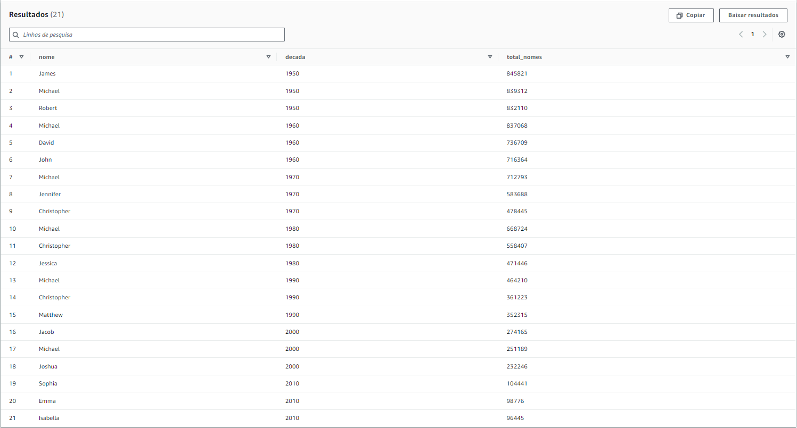

### CSV da query

[CSV](<./evidencias/80aef88b-0196-4a77-8b20-fcc09e9edcf6%20(1).csv>)

## Lab 3 - lambda

### Print da tela Lambda

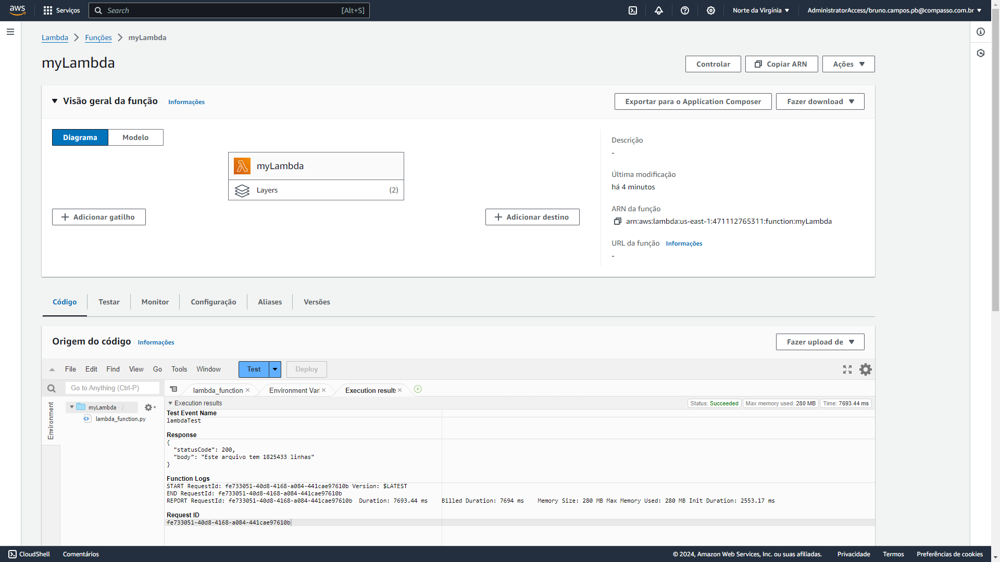

### Resultado da Lambda function

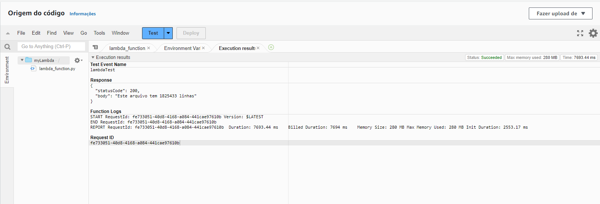

### Camadas da Lambda

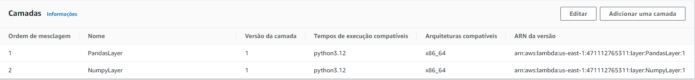

# Certificados

- ### Certificado do Curso Introduction to Amazon Kinesis Analytics

  

- ### Certificado do curso Best Practices for Data Warehousing with Amazon Redshift

  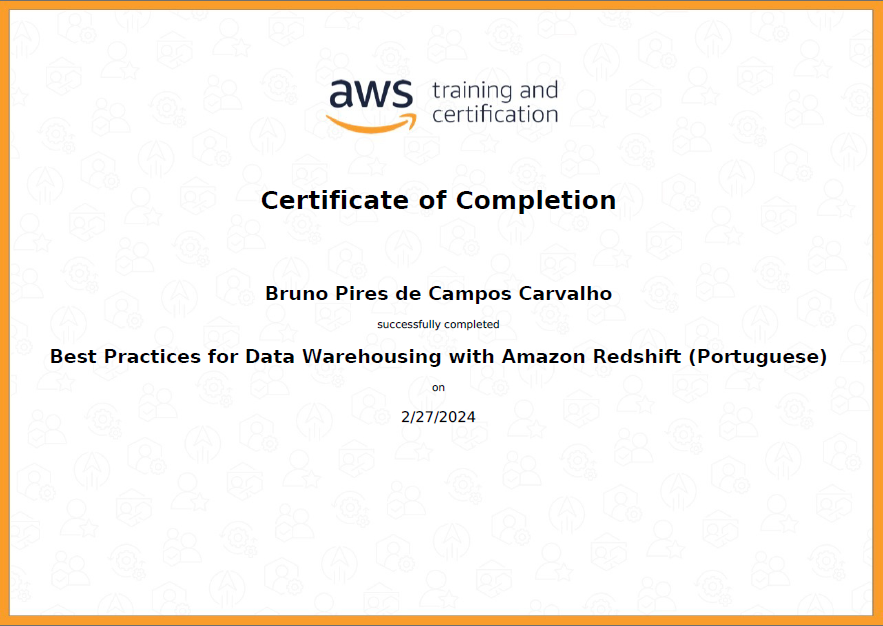

- ### Certificado do curso Getting Started with Amazon Redshift

  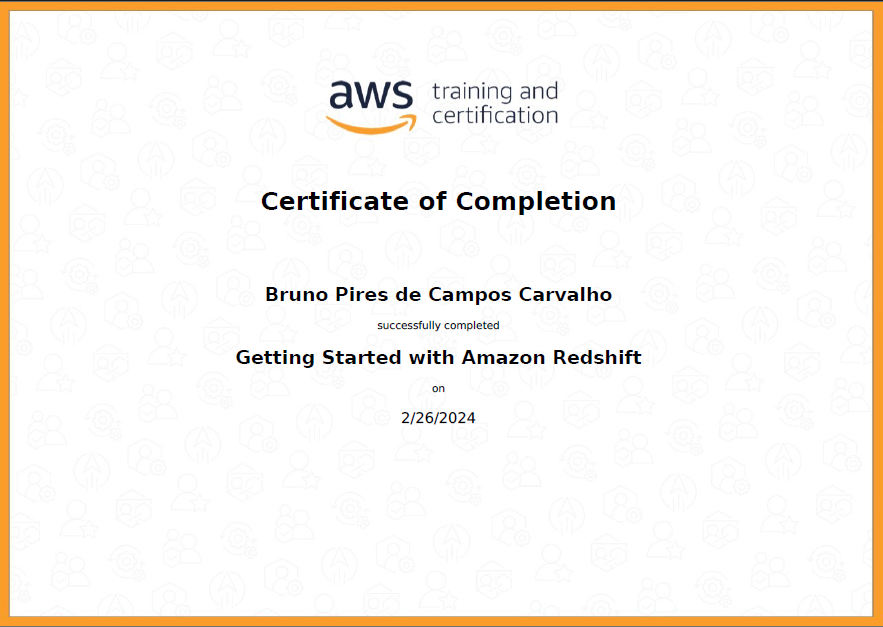

- ### Certificado do curso Introduction to Amazon Athena

  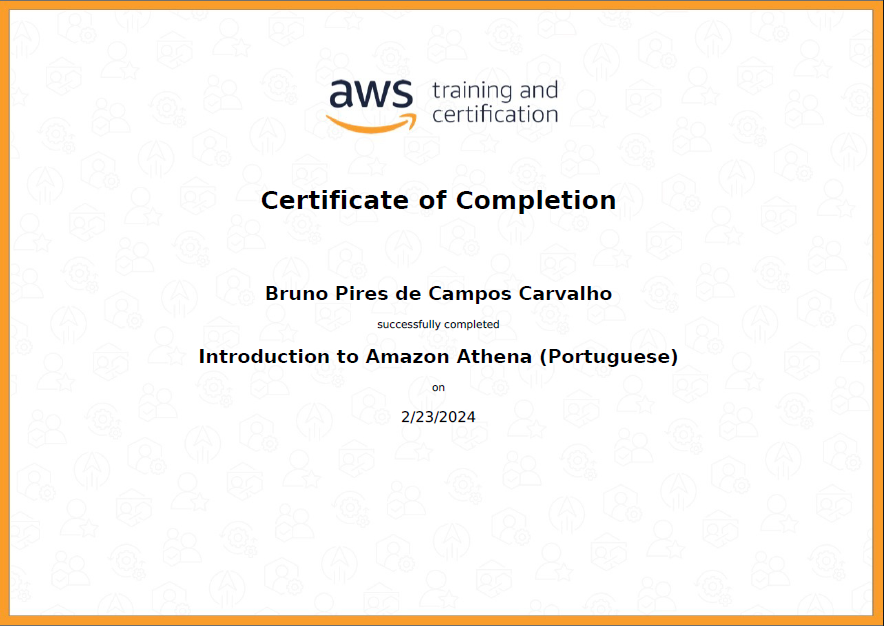

- ### Certificado do curso Introduction to AWS IoT Analytics

  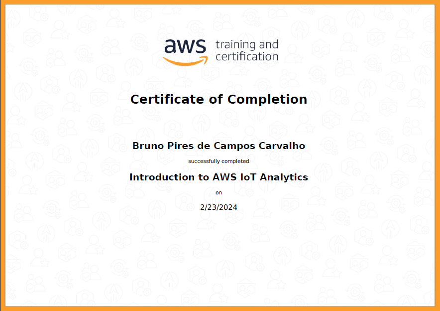

- ### Certificado do curso AWS Partner: Data Analytics on AWS

  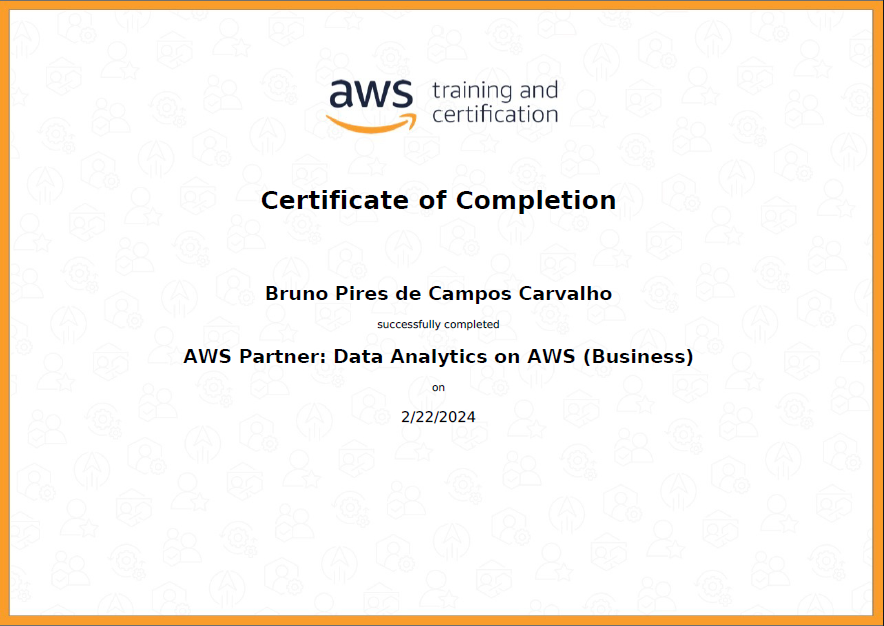

- ### Certificado do curso Data Analytics Fundamentals

  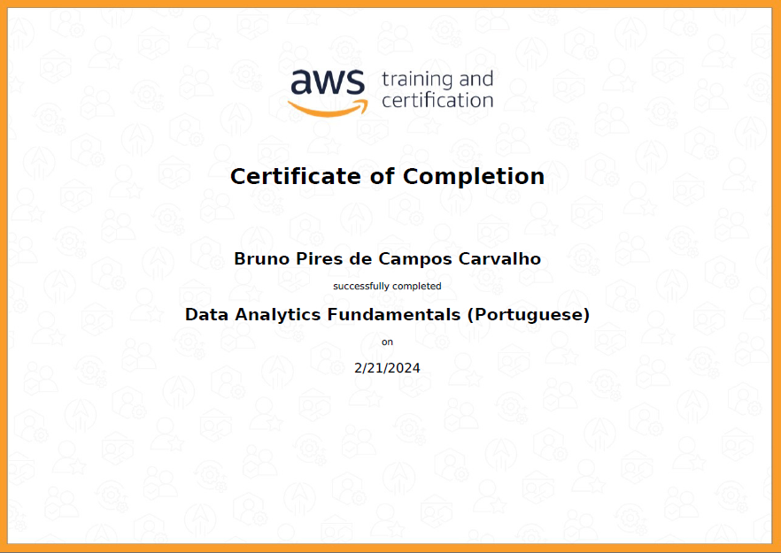

- ### Certificado do curso Deep Dive into Concepts and Tools for Analyzing Streaming Data

  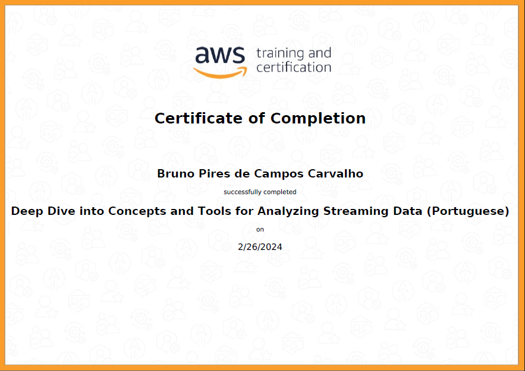

- ### Certificado do curso Introduction to Amazon Elastic MapReduce (EMR)

  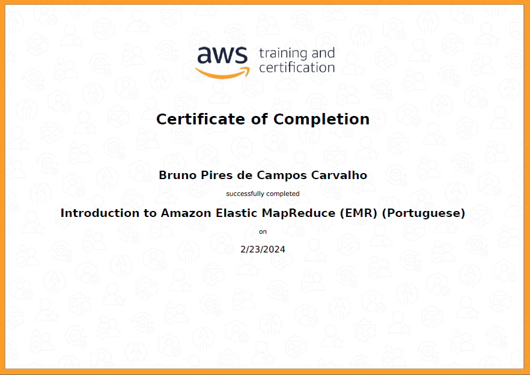

- ### Certificado do curso Introduction to Amazon Kinesis Streams

  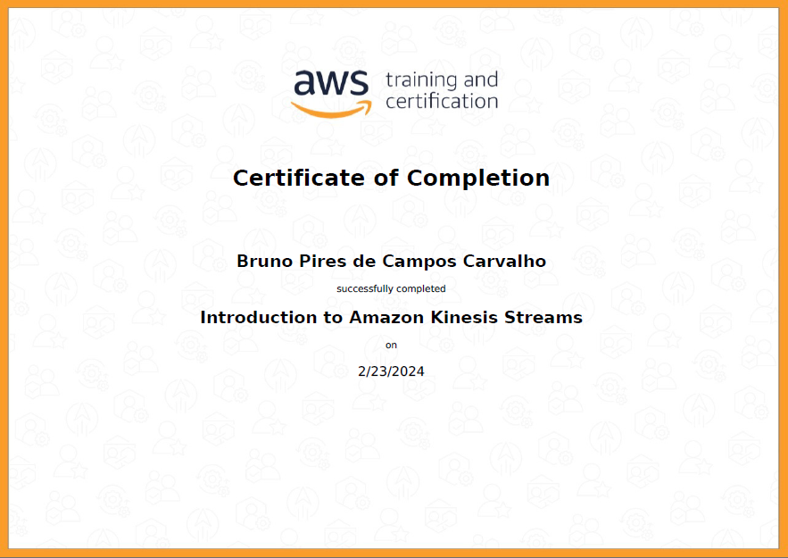

- ### Certificado do curso Introduction to Amazon Quicksight

  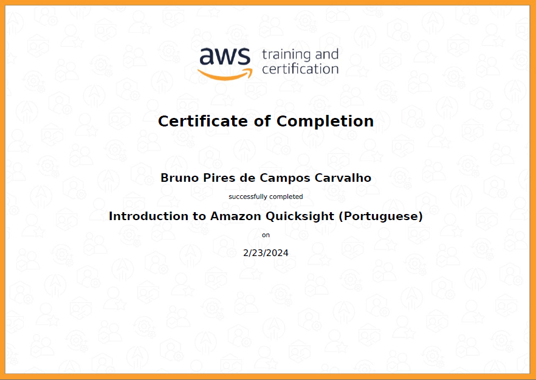

- ### Certificado do curso Serverless Analytics

  

- ### Certificado do curso Why Analytics for Games
  
