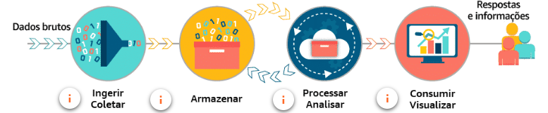
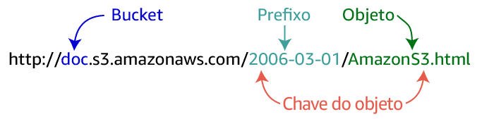
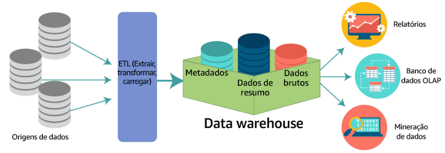
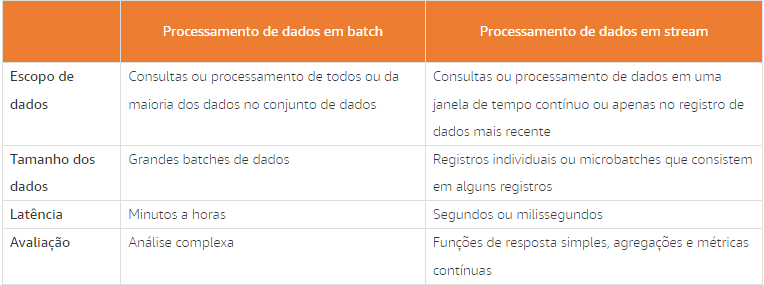
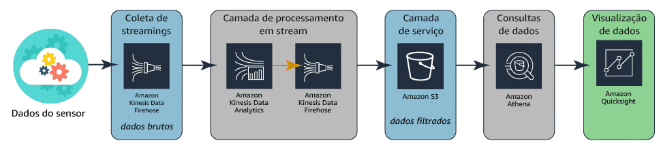
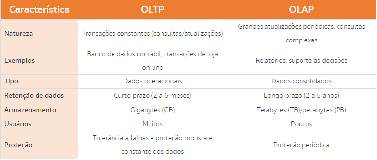
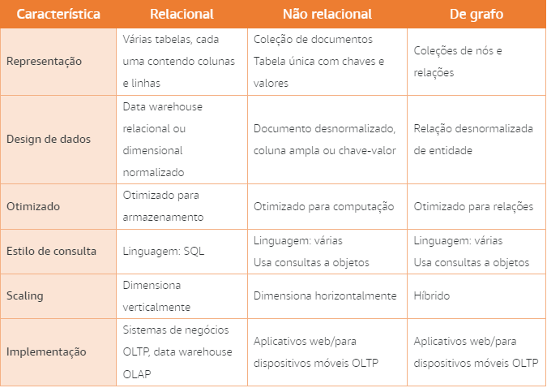
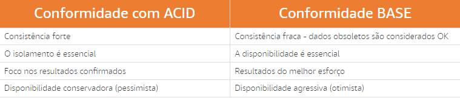
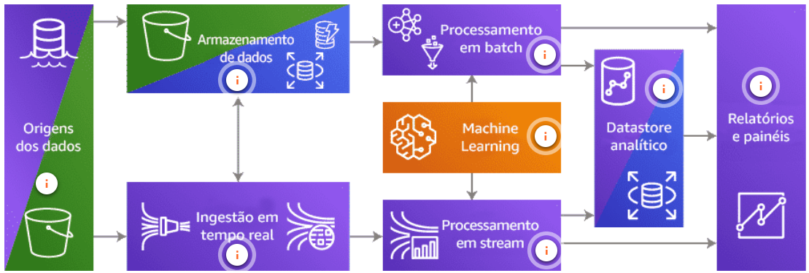

# **Data Analytics Fundamentals**

## 1 - **Introdução a soluções de avaliação de dados**

### **Análise de dados e soluções de avaliação de dados**

- **`Avaliação`** é um exame detalhado de algo para entender sua natureza ou determinar suas características essenciais. **`Avaliação de dados`** é o processo de compilar, processar e analisar dados para que você possa usá-los para tomar decisões.
- A análise de dados é vital para empresas de pequeno e grande porte. Elas ajudam as empresas a decidir onde e quando lançar novos produtos
- Soluções **`eficazes`** de `avaliação de dados` exigem armazenamento e capacidade de avaliação de dados **`praticamente em tempo real`**, com **`baixa latência`**, gerando **r`etornos de alto valor`**.
- Os desafios identificados em muitas soluções de avaliação de dados podem ser resumidos por cinco desafios principais: **`volume**, **velocidade**, **variedade**, **veracidade** e **valor**.`

- `Processar/Analisar` → Geralmente significa classificar, agregar, unir e aplicar lógica de negócios para produzir conjuntos de dados analíticos significativos

---

### **Introdução aos desafios de análise de dados**

- Conhecer a `origem dos dados` é um dos desafios.
- Dados podem vir tanto de `banco de dados e armazenamentos de arquivos on-premises`, através de `streaming` sendo uma fonte menos estruturada quanto através de `conjuntos de dados públicos` incluindo dados de censo, saúde, populacionais entre outros
- Outro desafio são as `opções para processamento de dados`, tendo como ideia que não se tem uma solução única para qualquer contexto, variando de acordo com o contexto do negócio
- Como último desafio temos `o que é preciso aprender com os dados`

## 2 - **Volume: armazenamento de dados**

- As empresas armazenam dados há décadas, isso não é novidade. O que mudou nos últimos anos foi a capacidade de analisar determinados tipos de dados.
- Há três classificações amplas de tipos de origem dos dados:
  - `Dados estruturados` →  são organizados e armazenados na forma de valores que são agrupados em linhas e colunas de uma tabela.
  - `Dados semiestruturados` →  muitas vezes são armazenados em conjuntos de pares de chave-valor que são agrupados em elementos em um arquivo.
  - `Dados não estruturados` → não são estruturados de forma consistente. Alguns dados podem ter uma estrutura semelhante a dados semiestruturados, mas outros podem conter apenas `metadados`.
- Plataformas modernas de gerenciamento de dados devem capturar dados de diversas fontes em velocidade e escala

### **Introdução ao Amazon S3**

- O `Amazon S3` é o armazenamento para a internet. Esse serviço foi projetado para facilitar a computação em escala web para os desenvolvedores. O Amazon S3 fornece uma interface simples de serviços da web que pode ser usada para armazenar e recuperar qualquer quantidade de dados, a qualquer momento e a partir de qualquer lugar.
- o Amazon S3 armazena dados como **`objetos`** em **`buckets`**.
- Um **`objeto`** é composto por um arquivo e quaisquer `metadados` que descrevam esse arquivo. Para armazenar um objeto no Amazon S3, você faz o upload do arquivo que deseja armazenar no bucket. Ao fazer o upload de um arquivo, você pode definir permissões no objeto e adicionar `metadados`.
- **`Buckets`** são contêineres lógicos para objetos. Você pode ter um ou mais buckets em sua conta e controlar o acesso a cada um individualmente. Você controla quem pode criar, excluir e listar objetos no bucket. Você também pode visualizar logs de acesso do bucket e seus objetos e escolher a região geográfica onde o Amazon S3 armazenará o bucket e o respectivo conteúdo.
- Depois que os objetos foram armazenados em um bucket do Amazon S3, eles recebem uma **`chave de objeto`**. Use isso, juntamente com o nome do bucket, para acessar o objeto.

- **Soluções de avaliação de dados no Amazon S3**
  - Com o `Amazon S3`, você pode armazenar de modo econômico todos os tipos de dados em seus respectivos formatos nativos. É possível usar o EC2 para trabalhar em conjunto e realizar as análises de dados
  - O `Amazon S3` facilita a criação de um ambiente multi-tenant em que muitos usuários podem trazer suas próprias ferramentas de análise de dados para um conjunto comum de dados.
  - É possível combinar `Amazon S3` com outros serviços AWS para consultar e processar dados. O Amazon S3 também se integra à computação sem servidor do AWS Lambda para executar código sem provisionar ou gerenciar servidores.
  - As APIs REST são interfaces de programação comumente usadas para interagir com arquivos no `Amazon S3`.

### **Introdução a data lakes**

- Por conta da extrema necessidade de organizar o `volume cada vez maior de dados`, os data lakes foram criados.
- Um **data lake** é um repositório centralizado que permite armazenar dados estruturados semiestruturadosenão estruturados em qualquer escala.
- Os **data lakes** prometem armazenar todos os dados de uma empresa em um `único repositório`. Você pode aproveitar os data lakes para armazenar grandes volumes de dados em vez de manter esses dados em data warehouses. Os data lakes, como os criados no `Amazon S3`, geralmente têm custo inferior às soluções especializadas de armazenamento de big data.
- **Benefícios de um data lake na AWS**
  - São uma solução **de armazenamento de dados econômica**. Você pode armazenar de forma durável uma quantidade quase ilimitada de dados usando o `Amazon S3`.
  - Implemente a **segurança e a conformidade** líderes do setor. A AWS usa rigorosos mecanismos de segurança, conformidade, privacidade e proteção de dados.
  - Permite que você aproveite **muitas ferramentas diferentes de coleta e ingestão** de dados para ingerir dados em seu data lake.
  - Ajudam você a **categorizar e gerenciar seus dados** de forma simples e eficiente. Use o AWS Glue para entender os dados dentro do seu data lake, prepará-los e carregá-los de forma confiável em `datastores`.
  - Ajuda você a transformar dados em **informações significativas**
- Os cientistas de dados passam **60%** do tempo **`fazendo a limpeza e organização de dados`** e **19% `coletando conjuntos de dados`**.
- Um data lake na AWS pode ajudar a:
  - Coletar e armazenar qualquer tipo de dados, em qualquer escala e com `baixo custo`;
  - Proteger os dados e `evitar acesso não autorizado`;
  - Catalogar, pesquisar e encontrar os dados relevantes em um `repositório central`;
  - Executar novos tipos de avaliação de dados com `rapidez e facilidade`;
  - Usar um amplo conjunto de mecanismos analíticos para análise única, streaming em tempo real, análise preditiva, IA e machine learning.

### **Introdução aos métodos de armazenamento de dados**

- **`Data warehouses`**
- **Um data warehouse é um  repositório central de dados estruturados de muitas origens de dados. Esses dados são transformados, agregados e preparados para relatórios e avaliações de negócios.**

- Um subconjunto de dados de um data warehouse é chamado de **`data mart`**. Os data marts **`se concentram em apenas um assunto ou uma área funcional`**. Um data warehouse pode conter todas as fontes relevantes para uma empresa, mas um data mart pode armazenar **apenas as `fontes de um único departamento`**.
- `Amazon Redshift` → um data warehouse na nuvem no qual o usuário não precisa se preocupar em atualizar, instalar, ou consertar
- O `Amazon EMR` é o serviço AWS que `implementa frameworks Hadoop`. Um processo do Amazon EMR começa ingerindo dados de uma ou mais origens de dados e armazenando esses dados em um sistema de arquivos. Se estiver usando o HDFS, o sistema de arquivos será armazenado como um volume do Elastic Block Store.

## 3 - **Velocidade: processamento de dados**

- A coleta e o processamento de dados são combinados em um único conceito conhecido como \*\*`processamento de dados`.
- A coleta de dados vindos de várias fontes para armazenamento e avaliação de origem única
- Processamento de dados sendo `formatação`, `organização`, e `controle de dados`

### **Introdução aos métodos de processamento de dados**

- Processamento em `batch` → Grandes intermitências de dados
  - **Processamento programado em batch** → representa dados que são processados em um volume muito grande de forma programada regularmente
  - **Processamento periódico em batch →** é um batch de dados processados em momentos irregulares
- Processamento em `stream` → Pequenas intermitências de dados
  - **Processamento quase em tempo real →** representa dados de streaming que são processados em `pequenos batches individuais`
  - **Processamento em tempo real** → representa dados de streaming que são processados em `batches individuais muito pequenos`
- `Aceleração de dados` → Outra característica principal da velocidade dos dados é a **_aceleração de dados_**, o que significa a taxa na qual grandes coleções de dados podem ser ingeridas, processadas e analisadas.

### **Introdução ao processamento de dados em batch**

- O processamento de dados em `batch` oferece às empresas a capacidade de se aprofundarem nos dados coletados para produzir `análise complexa` que não pode ser obtida apenas usando a análise de `streaming`.
- O `processamento em batch` é a execução de uma série de programas ou *trabalhos* em um ou mais computadores sem intervenção manual. Os dados são coletados em batches de maneira assíncrona. O batch é enviado a um sistema de processamento quando `condições específicas são atendidas`, como um horário específico do dia.
- O `Apache Hadoop` é um sistema escalável de armazenamento e processamento de dados em batch. Ele usa hardware de servidor de commodity e fornece tolerância a falhas por meio de software. Ele ingere e processa simultaneamente `grandes volumes de dados`, `estruturados` ou `não`, de qualquer quantidade de fontes, o que permite uma avaliação mais profunda do que qualquer outro sistema pode oferecer.
- `AWS Glue` → ETL
- Podemos ter um fluxo de análise de dados básico com os seguintes serviços da AWS:
  - `S3` → para armazenar os dados
  - `AWS Lambda` → para ETL intermediário em nível de arquivo
  - `Amazon EMR` ou `AWS Glue` → para ETL agregado(trabalho pesado, transformação consolidada)
  - `Amazon Redshift` → como hospedagem de dados em data warehouse para geração de relatório

### **Introdução ao processamento de dados de stream**

- O processamento de dados em stream é uma das áreas de processamento que mais cresce. O número de dispositivos coletando `informações em tempo real` está crescendo rapidamente. Isso impulsiona a necessidade por soluções de processamento que correspondam à `velocidade da geração de dados`.
- O processamento de dados em stream oferece às empresas a capacidade de obter informações de seus dados `em segundos após a coleta dos dados`.
- Em um sistema de processamento em `batch`, o processamento é sempre assíncrono e o sistema de `coleta` e de `processamento` costumam ser `agrupados`. Com soluções de `streaming`, o sistema de coleta (produtor) e o sistema de processamento (consumidor) `são sempre separados`
- O `sistema de coleta` suporta ordenação de dados e tem uma forte consistência
- O `sistema de processamento` consome os dados, roda os trabalhos e notifica quando os dados já não são mais necessários
- **`Processamento de dados em stream com o Amazon Kinesis`**
  - No processamento em stream, você usa vários serviços: um serviço para ingerir o stream constante de dados, outro para processar e analisar o stream, e outro para carregar os dados em um `datastore analítico`, se necessário. O `Amazon Kinesis` atende a cada uma dessas necessidades
- `Amazon Athena` → Server para realizar queries em dados armazenados no `S3`

- É importante lembrar que a análise de `streaming` é `muito limitada`. Devido ao tamanho de cada pacote de dados e à velocidade de movimentação dos dados, você está limitado à `análise simples`, como **agregar** e **filtrar os dados**

## 4 - **Variedade: estruturas e tipos de dados**

### **Introdução ao armazenamento de dados de origem**

- Cada solução de avaliação de dados começa com uma `origem dos dados`. Uma origem dos dados pode ser praticamente qualquer coisa: uma `pasta em um servidor de arquivos`, um `banco de dados`, uma `página web` e até mesmo um dispositivo wearable podem ser considerados uma origem de dados. Em cada uma dessas origens, os dados são `armazenados de forma específica`

### **Tipos de origem de dados**

- `Dados Estruturados` → são armazenados em um formato tabular, muitas vezes em um `sistema de gerenciamento de banco de dados` (DBMS). Esses dados são organizados com base em um modelo de dados relacional que define e padroniza elementos de dados e a relação deles entre si.
- A desvantagem dos dados estruturados é a `falta de flexibilidade`.

---

- **`Dados semiestruturados` →** são armazenados na forma de `elementos em um arquivo`. Esses dados são organizados com base nos elementos e atributos que os definem. Eles não estão em conformidade com modelos ou esquemas de dados. Os dados semiestruturados são considerados como tendo uma estrutura `autodescritiva`. Cada elemento é uma única instância de alguma coisa, como uma conversa.
- A diferença é a `análise`. Pode ser mais difícil analisar dados semiestruturados quando os analistas `não conseguem prever` quais atributos estarão presentes em um determinado conjunto de dados

---

- **`Dados não estruturados` →** são armazenados na `forma de arquivos`. Esses dados não estão em conformidade com um modelo de dados predefinido nem organizados de maneira predefinida. Dados não estruturados podem ser `arquivos de texto`, `fotografias`, `gravações` `de áudio` ou até mesmo vídeos. Dados não estruturados estão `cheios de informações irrelevantes`, o que significa que os arquivos precisam ser pré-processados para fazer avaliações significativas.

### **Introdução a datastores estruturados**

- Os dados estruturados são classificados como dados armazenados em um banco de dados ou em um sistema de gerenciamento de banco de dados (DBMS)
- **`Bancos de dados relacionais`**
  - Um banco de dados relacional é criado para armazenar `dados estruturados` para que possam ser coletados, atualizados e `consultados facilmente`. Bancos de dados relacionais dependem de uma série de estruturas, chamadas de `tabelas`, para armazenar os dados coletados. Essas tabelas são navegadas usando a `linguagem de consulta estruturada` ou SQL.
  - Uma coluna, conhecida como `campo`, é usada para descrever um atributo da entidade. Uma linha, conhecida como `registro`, na tabela representa uma única instância de uma entidade.
- Há duas maneiras principais, conhecidas como `sistemas de informação`, de organizar dados em um banco de dados relacional. Os dados podem ser organizados para se concentrar no `armazenamento de transações` ou no processo de `análise de transações`.
- `Bancos de dados de processamento de transações on-line (OLTP)` → organizam logicamente os dados em tabelas, com foco principal na `velocidade da entrada de dados`. Esses bancos de dados são caracterizados por um grande número de pequenas operações de **inserção**, **atualização** e **exclusão**
- `Bancos de dados de processamento analítico on-line (OLAP)` → organizam logicamente os dados em tabelas, com foco principal na `velocidade da recuperação de dados por meio de consultas`. Esses bancos de dados são caracterizados por um número relativamente baixo de operações de gravação e a falta de operações de atualização e exclusão, além disso as queries são na sua maioria `complexas` e envolvem agregações de um grande número de `conjunto de dados históricos`

### **Introdução a datastores semiestruturados e não estruturados**

- Os dados semiestruturados e não estruturados geralmente são armazenados em sistemas de banco de dados não relacionais, às vezes chamados de `bancos de dados NoSQL`.
- **`Bancos de dados não relacionais`**
  - Bancos de dados não relacionais são criados para armazenar dados `semiestruturados` e `não estruturados` de uma forma que ofereça rápida coleta e recuperação. Existem várias categorias amplas de bancos de dados não relacionais e os dados são armazenados em cada um para atender a requisitos específicos.
  - Os armazenamentos de `documentos` são um tipo de banco de dados não relacional que armazena dados semiestruturados e não estruturados na forma de arquivos. Esses arquivos variam em forma, mas incluem `JSON, BSON e XML`. Os arquivos podem ser navegados usando várias linguagens, incluindo Python e Node.js.
  - Bancos de dados de chave-valor são um tipo de banco de dados não relacional que armazena dados não estruturados na forma de pares de chave-valor. Os dados são armazenados em uma `única tabela`. Na tabela, os valores são associados a uma chave específica
  - Com um banco de dados não relacional, cada registro pode ter `seu próprio conjunto de atributos`. Essa flexibilidade é um dos maiores benefícios dos bancos de dados não relacionais.
    

## 5 - **Veracidade: limpeza e transformação**

- Os dados sofrem alterações ao longo do tempo. À medida que são transferidos de um processo para outro, e por um sistema e outro, há oportunidades para que a integridade dos dados seja afetada negativamente.

### **Compreensão da integridade dos dados**

- A integridade dos dados tem a ver com garantir que seus dados sejam `confiáveis`. Eles têm integridade? Toda a cadeia de dados estava segura e sem comprometimento?
- **`Limpeza de dados` →** \*\*é o processo de detecção e correção de corrupções nos dados.
- **`Integridade referencial` → \*\***é o processo para garantir que as restrições das relações da tabela sejam impostas.
- **`Integridade do domínio` → \*\***é o processo para garantir que os dados inseridos em um campo correspondam ao tipo de dados definido para esse campo*.*
- **`Integridade da entidade` → \*\***é o processo para garantir que os valores armazenados em um campo correspondam às restrições definidas para esse campo.
- Bancos de dados relacionais dependem de `esquemas de banco de dados` para organizar o conteúdo dentro do banco de dados e impor a `integridade referencial` e `de domínio`. Os programadores também usam esses esquemas ao escrever o software para `interagir com o banco de dados`.
- `Esquema de dados` → é o conjunto de `metadados` usado pelo banco de dados para organizar objetos de dados e impor restrições de integridade. O esquema define os atributos do banco de dados, fornecendo as descrições de cada objeto e como ele interage com outros objetos no banco de dados.
- Há dois tipos de esquemas: `lógico` e `físico`.
  - `Esquemas lógicos` → se concentram nas restrições a serem aplicadas aos dados no banco de dados. Isso inclui a organização de tabelas, visualizações e verificações de integridade.
  - `Esquemas físicos` → se concentram no armazenamento real de dados em disco ou em um repositório de nuvem. Esses esquemas têm detalhes sobre os arquivos, índices, tabelas particionadas, clusters e muito mais.
- Um `esquema de informações` é um banco de dados de `metadados` que armazena informações sobre os objetos de dados em um banco de dados.

### **Compreensão da consistência do banco de dados**

- **`ACID` →**  é um acrônimo para **`A`**tomicidade, **`C`**onsistência, **`I`**solamento e **`D`**urabilidade. É um método para manter a consistência e a integridade em um banco de dados estruturado.
- O objetivo de um banco de dados compatível com `ACID` é retornar a versão mais recente de todos os dados e garantir que os dados inseridos no sistema atendam a todas as regras e restrições atribuídas em todos os momentos.
- `Atomicidade` → Ao executar uma transação em um banco de dados, a atomicidade garante que suas transações sejam bem-sucedidas por completo ou falhem por completo.
- `Consistência` → A consistência garante que todas as transações forneçam `dados válidos` para o banco de dados. Esses dados devem aderir a todas as regras e restrições definidas.
- `Isolamento` → O isolamento garante que uma transação não possa interferir em outra transação simultânea.
- `Durabilidade` → A durabilidade dos dados tem a ver com garantir que suas alterações realmente se mantenham.
- **`BASE`** é um acrônimo para **`BA`**sicamente disponível, e**`S`**tado flexível, **`E`**ventualmente consistente. É um método para manter a consistência e a integridade em um banco de dados estruturado ou semiestruturado.

### **Introdução ao processo de ETL**

- Transformar seus dados em um formato uniforme e consultável é realmente o centro do processo de `ETL`.
- As transformações também podem ser mais `avançadas`, incluindo a aplicação de regras empresariais aos dados para calcular novos valores. `Filtragem`, `operações complexas de agrupamento`, `agregação de linhas`, `divisão de colunas` e validação de dados são tipos muito comuns de transformações aplicadas nessa fase.

## 6 - **Valor: relatórios e business intelligence**

- Armazenar terabytes de dados que nunca ninguém verá, analisará ou visualizará é um esforço inútil. O esforço real deve ser para descobrir `qual é o valor real dos dados` e aprender maneiras de extrair esse valor dos terabytes de dados coletados pela sua empresa.

### **Introdução à análise de dados**

- A análise de dados tem duas classificações: `análise de informações` e `análise operacional`. Análise de informações é o processo de análise de informações para encontrar o valor contido nelas. Já a análise operacional, se concentra nas `operações digitais` de uma organização.
- A `análise de informações` é uma série de processos com o objetivo de fornecer informações à empresa para tomar `decisões baseadas em dados`.
- A `análise operacional` é uma forma de análise usada especificamente para recuperar, analisar e relatar dados para operações de TI. Esses dados incluem `logs de sistema`, `logs de segurança`, eventos e processos complexos de infraestrutura de TI, `transações de usuários` e até mesmo ameaças à segurança.
- Através dos serviços da `AWS` podemos usá-los em conjunto das ferramentas de Machine Learning da Amazon para fazer `análises preditivas`
- **`Análise cognitiva` →** é a forma mais recente de análise de dados. Ele oferece uma oportunidade incrível de fornecer `recomendações altamente especializadas` para empresas sem qualquer envolvimento humano, além da configuração inicial e do treinamento dos modelos de ML.
- **Exemplos:**
  - Software financeiro que fornece recomendações de investimento precisas, em tempo real e baseadas em fatos;
  - Software para a área de saúde que oferece aos clientes acesso a recomendações confiáveis sobre tratamentos e opções atualizadas de saúde;

---

### **Introdução à visualização de dados**

- Os `relatórios analíticos` são apresentados em vários formatos e tamanhos diferentes. A origem dos dados raramente afeta os relatórios resultantes. Os relatórios são organizados para atender às necessidades dos consumidores dos relatórios.
- **Há três tipos amplos de relatórios: `estáticos`, `interativos` e `painéis`.**
  - **`Estáticos` →** São encontrados em formato PDF e slides do PowerPoint e, muitas vezes, podem ser acessados por meio de portais da web e interfaces de software.
  - `Interativos` → Esses relatórios costumam ter um estilo de relatório para impressão, mas têm a vantagem de que os consumidores podem aplicar filtros a tabelas e gráficos, alterar as escalas e até mesmo agrupar e classificar os valores nos relatórios.
  - `Painéis` → Os consumidores encontram o maior benefício em painéis quando se concentram em roll-ups de alto nível dos principais fatores de negócios.
- Relatórios e painéis são compostos por vários gráficos e tabelas para `responder perguntas`.

## Resumo

`Pipeline de dados`

