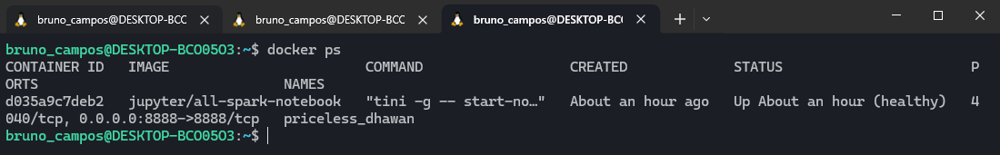
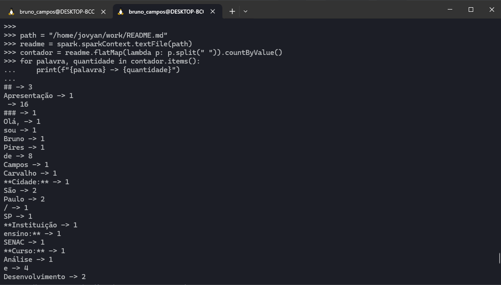

## Comandos no terminal Spark

- path = "/home/jovyan/work/README.md"
- readme = spark.sparkContext.textFile(path)
- contador = readme.flatMap(lambda p: p.split(" ")).countByValue()
- for palavra, quantidade in contador.items():
  - print(f"{palavra} -> {quantidade}")

## Print Docker

## Print comandos Spark

