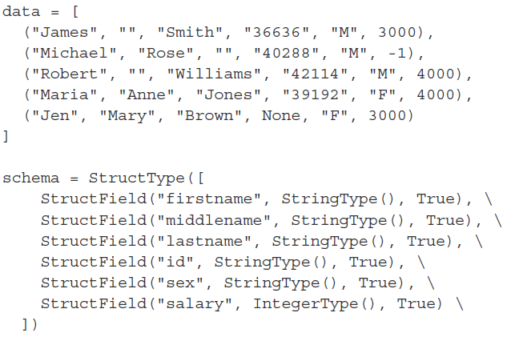

# Spark

## O que é?

- É uma ferramenta de `processamento de dados`
- Distribuído em `cluster`
- Em memória
- Extremamente `veloz` e altamente `escalável`
- Pode processar dados em `HDFS` ou `Cloud`
- Divide o processamento entre os diversos computadores do `cluster`
- Os dados que o spark processa são `copiados entre os nós do cluster`, trazendo benefícios como `tolerância a falhas`
- O Spark não substitui, por exemplo, linguagens de programação ou SQL
- O Spark tem várias vertentes no processamento de dados como:
  - `Machine Learning (MLib)`
  - `SQL (Spark SQL)`
  - `Processamento em Streaming`
  - `Processamento em Grafos (GraphX)`
- O Spark trabalha em `Lazy Evaluation`, ou seja o processamento de transformações de fato só ocorre quando há uma `ação`, como mostrar os dados por exemplo
- Transformações são todas operações sobre um DataFrame que resultam num `novo DataFrame` com forma ou dados alterados.


- As aplicações Spark são executados como conjuntos independentes de processos em um cluster, coordenados pelo objeto `SparkContext` em seu programa principal
- Para ser executado em um cluster, o `SparkContext` pode se conectar a vários tipos de
  gerenciadores de cluster `(YARN)` , que alocam recursos entre as aplicações.
- Aplicações podem ser submetidas a um cluster Spark através do script `spark-submit`
- a criação de uma `SparkSession` é a primeira parte do código Spark, pois é a forma de acessar todos as funcionalidades do framework. Por isso, essa é normalmente a primeira instrução que você escreve para programar com RDDs, `Datasets` ou `DataFrames`.

## Data Frames e RDDs

- `R`esilient `D`istributed `D`atasets → É uma estrutura básica de baixo nível contendo dados imutáveis, distribuídos pelo cluster. Por estar distribuído no cluster, ele é tolerante a falhas
- Além disso o `RDD` é complexo e verboso, necessitando de bastante código para execução de tarefas
- Data Sets e Data Frames são parecidos com `tabelas em um banco de dados`
- **Data Sets** estão disponíveis apenas na linguagem `Java` e `Scala`
- **Data Frames** são versões mais atualizadas de **Data Sets** e mais utilizados no dia a dia

### Data Frames

[**Comandos do Spark sql**](https://images.datacamp.com/image/upload/v1676302905/Marketing/Blog/PySpark_SQL_Cheat_Sheet.pdf)

- Tabelas com linhas e colunas
- Imutáveis
- Com Schema conhecido
- Linhagem preservada
- Colunas podem ter tipos diferentes
- Existem análises comuns: `Agrupar`, `ordenar`, `filtrar`
- Spark pode otimizar estas analises através de `planos de execução`
- Outro comando para a mesma finalidade é o `spark.read.load(<caminho_do_arquivo>, header=, format="csv", sep=, inferSchema=)`
- **Operadores lógicos do spark:**
  - `& = and`
  - `| = or`
  - `~ = not`
- Não da para alterara nada na estrutura do data frame já criado pois ele é um `objeto imutável`. Para conseguirmos mudar por exemplo o nome de uma coluna de um data frame, precisamos criar outro e usar o método `withColumnRenamed`
- Para usar o `groupBy` precisamos do `agg` para dizer que o modo vamos agregar os dados(**sum, etc…**)

### Principais comandos

- `sparkSession.builder.master().appName().getOrCreate()` → inicia uma sessão Spark para ter acesso às funcionalidades do Spark
- `spark.createDataFrame(<valores>)` → cria um data frame através do valores passados por uma lista
- Exemplo de dados para usar na criação de um `DataFrame`



- `<nome_do_dataframe>.show()` → mostra as colunas do data frame criado
- `schema` → serve para indicar os tipos doados dos dados que serão criados e os seus respectivos nomes/identificadores. E.g. schema = `“Produtos STRING, Vendas INT”`
- De `spark.sql.functions` podemos importar a função `sum` para agregar valores
- `<nome_do_dataframe>.groupBy(”coluna”).agg(sum("coluna_da_soma"))` → o `groupBy` funciona de forma semelhante ao `SQL` agrupando os dados de acordo com a coluna e as funções `agg` e `sum` pegam os valores da outra coluna selecionada para realizar a operação **(soma nesse caso)**
- `<nome_do_dataframe>.select("coluna").show()` → mostra os dados da coluna indicada
- `<nome_do_dataframe>.columns` → mostra todas as colunas do data frame
- `<nome_do_dataframe>.schema` → mostra o nome e o tipo dos dados do data frame
- Para inserir dados externos no spark, podemos usar o comando `spark.read.csv(<caminho_do_arquivo>, header=, schema=)`
- `from pyspark.sql.functions import col` → o método importado `‘col’` serve para que possamos indicar a coluna que vamos referenciar dentro de uma operação
- `df.select(<coluna>)` → seleciona uma ou mais colunas de um DataFrame
- `.alias(<coluna>)` → cria uma lias para um coluna na hora de representar no DataFrame
- `df.withColumn()` → serve para adicionar uma nova coluna, alterar o valor de uma coluna já existente ou converter o tipo de dado de um coluna

### Exportando e Importando dados

- Para `exportar` arquivos vamos passar o nome do data frame que será exportado, o formato a ser salvo e o local onde será salvo → `<dataframe>.write.format("").save("<caminho>")`
- O formato pode ser: `csv`, `parquet`, etc
- Para `importar` usamos o comando → `spark.read.format("<formato>").load("<caminho>")`

## Spark SQL

- Permite usar os comandos conhecidos de `SQL` no spark
- `Tabela:`
  - Persistente
  - Objeto tabular que reside em um banco de dados
  - Pode ser gerenciado e consultado utilizando SQL
  - Totalmente interoperável com DataFrame
- `Views:`
  - São uma `alias` para uma tabela
  - Como se fosse um atalho para uma tabela
  - Não contém dados
- Para transformar um data frame em tabela usamos o comando → `<dataframe>.write.saveAsTable(”<nome_da_tabela>”)`
- `join` → Para a API de Data Frame podemos fazer um join da seguinte maneira: **`df.join(tabela1, coluna_tabela1 == coluna_tabela2, “tipo_join”).select(”colunas”).show()`**

## Outras fontes de dados

- Você pode se `conectar com outras fontes de dados` com Spark, gravar os dados de volta na mesma fonte de onde vieram
- Podemos tratar esses dados como Data Frames e até persisti-los como tabelas

## Criando aplicações

- Podemos usar um script de `Python` para realizar consultas e criar data frames por exemplo
- Através do `WSL` e a **IDE vscode**, podemos criar e editar o arquivo para iniciar uma seção do `Spark` e usar os comandos já conhecidos para ler arquivos e criar consultas
- Exemplo de script Python

```python
from pyspark.sql import SparkSession
from pyspark.sql.functions import *

if __name__ == "__main__":
    spark = SparkSession.builder.appName("Exemplo").getOrCreate()
    arqschema = "id INT, nome STRING, status STRING, cidade STRING, vendas INT, data STR ING"
    despachantes = spark.read.csv("/home/bruno_campos/download/despachantes.csv", header=False, schema = arqschema)
    calculo = despachantes.select("data").groupBy(year("data")).count()
    calculo.write.format("console").save()
    spark.stop()
```

## Otimização

- Spark faz o particionamento dos dados em diversos nodes, além de trabalhar com dados em paralelo, aumentando a eficiência do processamento
- Para criar uma partição de um data frame, usamos o comando: `df.write.partitionBy(”Geography”).saveAsTable(”table_name”)`
- `Cache` → forma de reutilizar os dados, é gerado por padrão pelo Spark
- `Persist` → Outra forma de reutilizar os dados definidos pelo usuário
- Usando a biblioteca `StorageLevel`, podemos ver se o data frame atual está em cache ou persistido
- Caso ao usar o comando `df.storageLevel` apareça → `StorageLevel(False, False, False, False, 1)`, significa que o data frame não está persistido em nenhum lugar
- Para remover do cache ou persist, usasse o comando → `df.unpersist()`

## Outras informações

- Quando estamos usando o `Spark` fora do ambiente do `WSL` com o terminal, precisamos criar um contexto do `Spark` para que os comandos possam ser executados
- Podemos transformar uma DataFrame do Spark em um DataFrame do pandas e vice-versa
- Comando `Spark to pandas` → `df.toPandas()`
