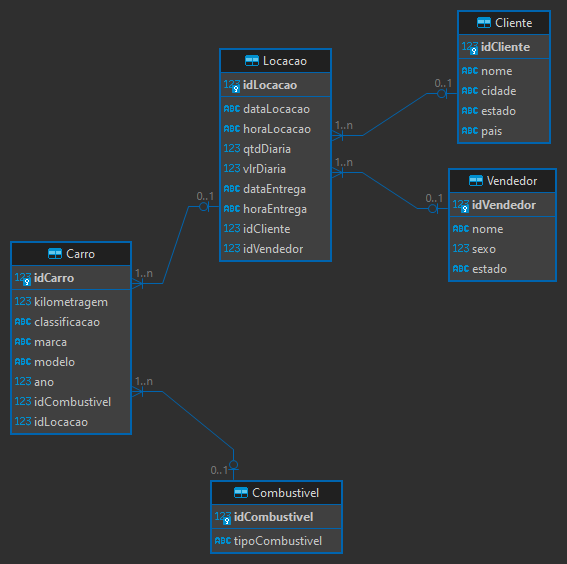
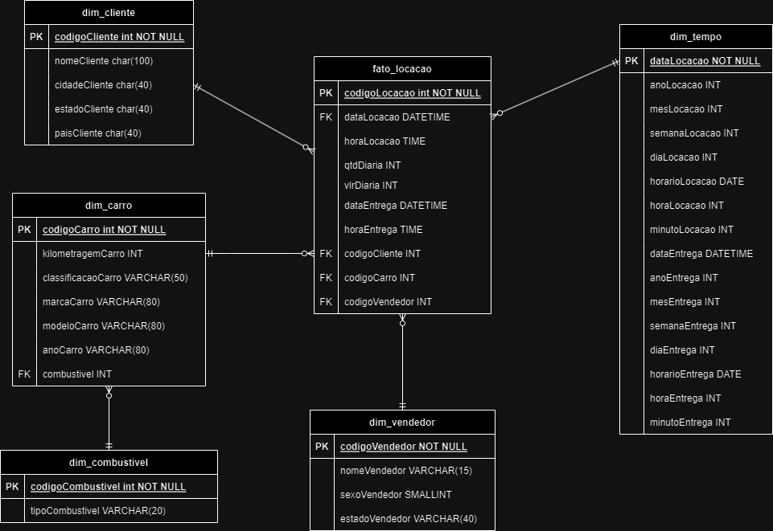

# Evidências

## Tarefa 1 - Normalização

### O objetivo da tarefa 1 é, através de uma base de dados sqlite, normalizar os dados da tabela tb_locacao, possivelmente criando outras tabelas menores para guardarem os dados da tabela principal, que poderão se relacionar entre si.

### [Script SQL de normalização](./evidencias/Script_normalizacao.sql)

### Modelagem Lógica feita no SQL Client DBeaver utilizando devidos relacionamentos entre as tabelas

### 

## Tarefa 2 - Modelagem Dimensional

### Com os dados já normalizados, o objetivo dessa tarefa é transformar as tabelas e seus dados em um Modelo Dimensional, criando tabelas de dimensões e fatos para que seja facilitada a análise dos dados por meio de ferramentas OLAP, fazendo com que esses dados possam ser analisados através de multiplas perspectivas

### [Script SQL para o Modelo Dimensional](./evidencias/script_dimensional.sql)

### Modelagem Dimensional feita no Drawio utilizando devidos relacionamentos entre as tabelas

